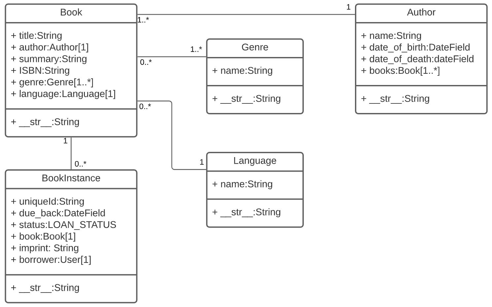
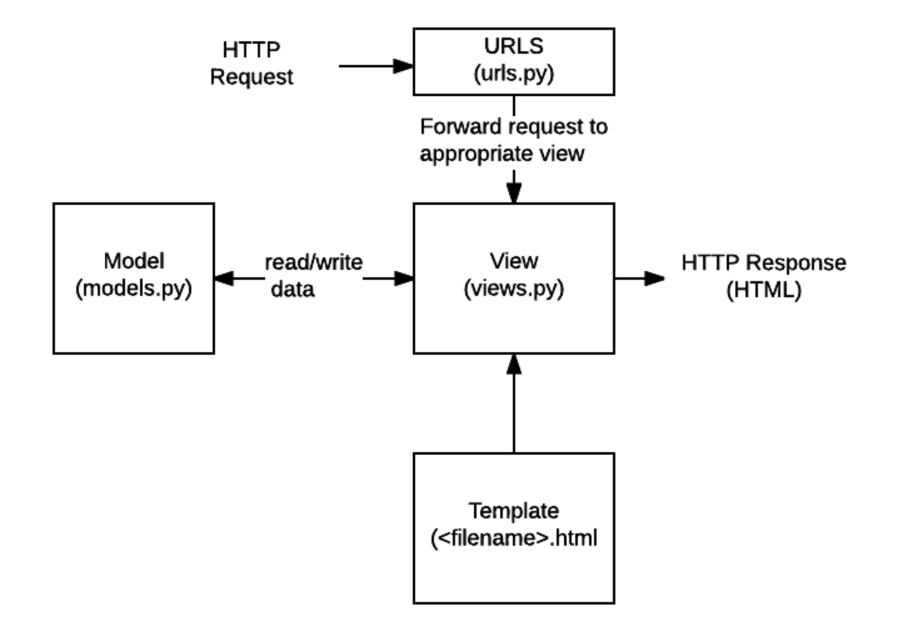
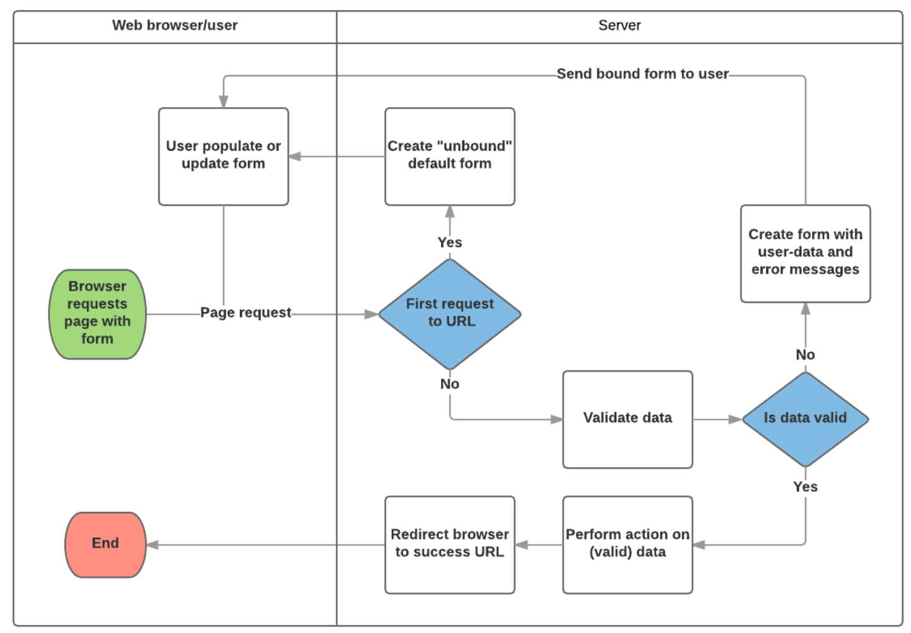

# Django Tutorial: The Local Library website

The first article in our practical tutorial series explains what you'll learn, and provides an overview of the "local library" example website we'll be working through and evolving in subsequent articles.

## Overview

Welcome to the MDN "Local Library" Django tutorial, in which we develop a website that might be used to manage the catalog for a local library.

In this series of tutorial articles you will:

- Use Django's tools to create a skeleton website and application.
- Start and stop the development server.
- Create models to represent your application's data.
- Use the Django admin site to populate your site's data.
- Create views to retrieve specific data in response to different requests, and templates to render the data as HTML to be displayed in the browser.
- Create mappers to associate different URL patterns with specific views.
- Add user authorization and sessions to control site behavior and access.
- Work with forms.
- Write test code for your app.
- Use Django's security effectively.
- Deploy your application to production.

You have learned about some of these topics already, and touched briefly on others. By the end of the tutorial series you should know enough to develop simple Django apps by yourself.

## The LocalLibrary website

***
*LocalLibrary* is the name of the website that we'll create and evolve over the course of this series of tutorials. As you'd expect, the purpose of the website is to provide an online catalog for a small local library, where users can browse available books and manage their accounts.

This example has been carefully chosen because it can scale to show as much or as little detail as we need, and can be used to show off almost any Django feature. More importantly, it allows us to provide a guided path through the most important functionality in the Django web framework:

- In the first few tutorial articles we will define a simple browse-only library that library members can use to find out what books are available. This allows us to explore the operations that are common to almost every website: reading and displaying content from a database.
- As we progress, the library example naturally extends to demonstrate more advanced Django features. For example we can extend the library to allow users to reserve books, and use this to demonstrate how to use forms, and support user authentication.

Even though this is a very extensible example, it's called LocalLibrary for a reason — we're hoping to show the minimum information that will help you get up and running with Django quickly. As a result we'll store information about books, copies of books, authors and other key information. We won't however be storing information about other items a library might store, or provide the infrastructure needed to support multiple library sites or other "big library" features.

### I'm stuck, where can I get the source?

As you work through the tutorial we'll provide the appropriate code snippets for you to copy and paste at each point, and there will be other code that we hope you'll extend yourself (with some guidance).

If you get stuck, you can find the fully developed version of the website on [Github here.](https://github.com/mdn/django-locallibrary-tutorial)

## Summary

Now that you know a bit more about the LocalLibrary website and what you're going to learn, it's time to start creating a skeleton project to contain our example.

### In this module

- Django introduction
- Setting up a Django development environment
- Django Tutorial: The Local Library website
- Django Tutorial Part 2: Creating a skeleton website
- Django Tutorial Part 3: Using models
- Django Tutorial Part 4: Django admin site
- Django Tutorial Part 5: Creating our home page
- Django Tutorial Part 6: Generic list and detail views
- Django Tutorial Part 7: Sessions framework
- Django Tutorial Part 8: User authentication and permissions
- Django Tutorial Part 9: Working with forms
- Django Tutorial Part 10: Testing a Django web application
- Django Tutorial Part 11: Deploying Django to production
- Django web application security
- DIY Django mini blog

***

## Part 2: Creating a skelton website

This article shows how you can create a "skeleton" website, which you can then populate with site-specific settings, paths, models, views, and templates (we discuss these in later articles).

To get started:

1. Use the django-admin tool to generate a project folder, the basic file templates, and manage.py, which serves as your project management script. django-admin startproject(name)
2. Use manage.py to create one or more applications. py manage.py startapp(name)
3. Register the new applications to include them in the project.
4. Hook up the url/path mapper for each application.

> **Note:** A website may consist of one or more sections. For example, main site, blog, wiki, downloads area, etc. Django encourages you to develop these components as separate applications, which could then be re-used in different projects if desired.

For the Local Library website, the website and project folders are named locallibrary, and includes one application named catalog. The top-level folder structure will therefore be as follows:

    locallibrary/         # Website folder
        manage.py         # Script to run Django tools for this project (created using django-admin)
        locallibrary/     # Website/project folder (created using django-admin)
        catalog/          # Application folder (created using manage.py)

The following sections discuss the process steps in detail, and show how you can test your changes. At the end of this article, we discuss other site-wide configuration you might also do at this stage.

### Creating the Project

1. Open a command shell (or a terminal window), and make sure you are in your virtual environment. To Enter python3 -m venv venv
2. Navigate to where you want to store your Django apps (make it somewhere easy to find like inside your Documents folder), and create a folder for your new website (in this case: django_projects). Then change into your newly-created directory:

        mkdir django_projects && cd django_projects

3. Create the new project using the django-admin startproject command as shown, and then change into the project folder:

        django-admin startproject locallibrary
        cd locallibrary

The django-admin tool creates a folder/file structure as follows:

    locallibrary/
        manage.py
        locallibrary/
            __init__.py
            settings.py
            urls.py
            wsgi.py
            asgi.py

Our current working directory should look something like this:

    ../django_projects/locallibrary/

The *locallibrary* project sub-folder is the entry point for the website:

- `__init__.py` is an empty file that instructs Python to treat this directory as a Python package.
- settings.py contains all the website settings, including registering any applications we create, the location of our static files, database configuration details, etc.  
- urls.py defines the site URL-to-view mappings. While this could contain all the URL mapping code, it is more common to delegate some of the mappings to particular applications, as you'll see later.
- wsgi.py is used to help your Django application communicate with the webserver. You can treat this as boilerplate.
- asgi.py is a standard for Python asynchronous web apps and servers to communicate with each other. ASGI is the asynchronous successor to WSGI and provides a standard for both asynchronous and synchronous Python apps (whereas - WSGI provided a standard for synchronous apps only). It is backward-compatible with WSGI and supports multiple servers and application frameworks.

The manage.py script is used to create applications, work with databases, and start the development web server.

### Creating the catalog app

Next, run the following command to create the catalog application that will live inside our locallibrary project. Make sure to run this command from the same folder as your project's manage.py:

    python3 manage.py startapp catalog

The tool creates a new folder and populates it with files for the different parts of the application (shown in bold in the following example). Most of the files are named after their purpose (e.g. views should be stored in **views.py**, models in **models.py**, tests in **tests.py**, administration site configuration in **admin.py**, application registration in **apps.py**) and contain some minimal boilerplate code for working with the associated objects.

The updated project directory should now look like this:

    locallibrary/
        manage.py
        locallibrary/
        catalog/
            admin.py
            apps.py
            models.py
            tests.py
            views.py
            __init__.py
            migrations/

In addition we now have:

- A migrations folder, used to store "migrations" — files that allow you to automatically update your database as you modify your models.
- `__init__.py` — an empty file created here so that Django/Python will recognize the folder as a Python Package and allow you to use its objects within other parts of the project.
  
> **Note:** Have you noticed what is missing from the files list above? While there is a place for your views and models, there is nowhere for you to put your url mappings, templates, and static files. We'll show you how to create them further along (these aren't needed in every website but they are needed in this example).

### Registering the catalog application

Now that the application has been created, we have to register it with the project so that it will be included when any tools are run (like adding models to the database for example). Applications are registered by adding them to the INSTALLED_APPS list in the project settings.

Open the project settings file, **django_projects/locallibrary/locallibrary/settings.py,** and find the definition for the INSTALLED_APPS list. Then add a new line at the end of the list, as shown below:

    INSTALLED_APPS = [
        'django.contrib.admin',
        'django.contrib.auth',
        'django.contrib.contenttypes',
        'django.contrib.sessions',
        'django.contrib.messages',
        'django.contrib.staticfiles',
        # Add our new application
        'catalog.apps.CatalogConfig', #This object was created for us in /catalog/apps.py
    ]

The new line specifies the application configuration object (CatalogConfig) that was generated for you in **/locallibrary/catalog/apps.py** when you created the application.

> **Note:** You'll notice that there are already a lot of other INSTALLED_APPS (and MIDDLEWARE, further down in the settings file). These enable support for the Django administration site and the functionality it uses (including sessions, authentication, etc).

### Specifying the database

This is also the point where you would normally specify the database to be used for the project. It makes sense to use the same database for development and production where possible, in order to avoid minor differences in behavior.  You can find out about the different options in Databases (Django docs).

We'll use the SQLite database for this example, because we don't expect to require a lot of concurrent access on a demonstration database, and it requires no additional work to set up! You can see how this database is configured in `settings.py`:

    SQLite DB as a default DB

    DATABASES = {
        'default': {
            'ENGINE': 'django.db.backends.sqlite3',
            'NAME': BASE_DIR / 'db.sqlite3',
        }
    }

    Postgres DB

    DATABASES = {
        'default': {
            'ENGINE': 'django.db.backends.postgresql_psycopg2',
            'NAME': 'postgres',
            'USER': 'postgres',
            'PASSWORD': 'Rishi@2311',
            'HOST': 'localhost',
            'PORT': 5433,
        }
    }

Because we are using SQLite, we don't need to do any further setup here. Let's move on!

### Other project settings

The settings.py file is also used for configuring a number of other settings, but at this point, you probably only want to change the TIME_ZONE — this should be made equal to a string from the standard List of tz database time zones (the TZ column in the table contains the values you want). Change your TIME_ZONE value to one of these strings appropriate for your time zone, for example:

    TIME_ZONE = 'Europe/London'

There are two other settings you won't change now, but that you should be aware of:

- **SECRET_KEY.** This is a secret key that is used as part of Django's website security strategy. If you're not protecting this code in development, you'll need to use a different code (perhaps read from an environment variable or file) when putting it into production.
- **DEBUG.** This enables debugging logs to be displayed on error, rather than HTTP status code responses. This should be set to False in production as debug information is useful for attackers, but for now we can keep it set to True.

### Hooking up the URL mapper

The website is created with a URL mapper file (urls.py) in the project folder. While you can use this file to manage all your URL mappings, it is more usual to defer mappings to the associated application.

Open **locallibrary/locallibrary/urls.py** and note the instructional text which explains some of the ways to use the URL mapper.

    """locallibrary URL Configuration

    The `urlpatterns` list routes URLs to views. For more information please see:
        https://docs.djangoproject.com/en/3.1/topics/http/urls/
    Examples:
    Function views
        1. Add an import:  from my_app import views
        2. Add a URL to urlpatterns:  path('', views.home, name='home')
    Class-based views
        1. Add an import:  from other_app.views import Home
        2. Add a URL to urlpatterns:  path('', Home.as_view(), name='home')
    Including another URLconf
        1. Import the include() function: from django.urls import include, path
        2. Add a URL to urlpatterns:  path('blog/', include('blog.urls'))
    """
    from django.contrib import admin
    from django.urls import path

    urlpatterns = [
        path('admin/', admin.site.urls),
    ]

The URL mappings are managed through the urlpatterns variable, which is a Python list of path() functions. Each path() function either associates a URL pattern to a specific view, which will be displayed when the pattern is matched, or with another list of URL pattern testing code (in this second case, the pattern becomes the "base URL" for patterns defined in the target module). The urlpatterns list initially defines a single function that maps all URLs with the pattern admin/ to the module admin.site.urls , which contains the Administration application's own URL mapping definitions.

> **Note:** The route in path() is a string defining a URL pattern to match. This string might include a named variable (in angle brackets), e.g. `'catalog/<id>/'`. This pattern will match a URL like /catalog/any_chars/ and pass any_chars to the view as a string with parameter name id. We discuss path methods and route patterns further in later topics.

To add a new list item to the urlpatterns list, add the following lines to the bottom of the file. This new item includes a path() that forwards requests with the pattern catalog/ to the module catalog.urls (the file with the relative URL catalog/urls.py).

    # Use include() to add paths from the catalog application
    from django.urls import include

    urlpatterns += [
        path('catalog/', include('catalog.urls')),
    ]

> **Note:** Note that we included the import line (from django.urls import include) with the code that uses it (so it is easy to see what we've added), but it is common to include all your import lines at the top of a Python file.

Now let's redirect the root URL of our site (i.e. 127.0.0.1:8000) to the URL 127.0.0.1:8000/catalog/. This is the only app we'll be using in this project. To do this, we'll use a special view function, RedirectView, which takes the new relative URL to redirect to (/catalog/) as its first argument when the URL pattern specified in the path() function is matched (the root URL, in this case).

Add the following lines to the bottom of the file:

    #Add URL maps to redirect the base URL to our application
    from django.views.generic import RedirectView
    urlpatterns += [
        path('', RedirectView.as_view(url='catalog/', permanent=True)),
    ]

Leave the first parameter of the path function empty to imply '/'. If you write the first parameter as '/' Django will give you the following warning when you start the development server:

    System check identified some issues:

    WARNINGS:
    ?: (urls.W002) Your URL pattern '/' has a route beginning with a '/'.
    Remove this slash as it is unnecessary.
    If this pattern is targeted in an include(), ensure the include() pattern has a trailing '/'.

Django does not serve static files like CSS, JavaScript, and images by default, but it can be useful for the development web server to do so while you're creating your site. As a final addition to this URL mapper, you can enable the serving of static files during development by appending the following lines.

Add the following final block to the bottom of the file now:

    # Use static() to add url mapping to serve static files during development (only)
    from django.conf import settings
    from django.conf.urls.static import static

    urlpatterns += static(settings.STATIC_URL, document_root=settings.STATIC_ROOT)

> **Note:** There are a number of ways to extend the urlpatterns list (previously, we just appended a new list item using the += operator to clearly separate the old and new code). We could have instead just included this new pattern-map in the original list definition:

    mdn/urls.py (project main url file)
    urlpatterns = [
        path('admin/', admin.site.urls),
        path('catalog/', include('catalog.urls')),
        path('', RedirectView.as_view(url='catalog/')),
    ] + static(settings.STATIC_URL, document_root=settings.STATIC_ROOT)

As a final step, create a file inside your catalog folder called urls.py, and add the following text to define the (empty) imported urlpatterns. This is where we'll add our patterns as we build the application.

    from django.urls import path
    from . import views

    urlpatterns = [

    ]

### Testing the website framework

At this point we have a complete skeleton project. The website doesn't actually do anything yet, but it's worth running it to make sure that none of our changes have broken anything.

Before we do that, we should first run a database migration. This updates our database (to include any models in our installed applications) and removes some build warnings.

Running database migrations
Django uses an Object-Relational-Mapper (ORM) to map model definitions in the Django code to the data structure used by the underlying database. As we change our model definitions, Django tracks the changes and can create database migration scripts (in /locallibrary/catalog/migrations/) to automatically migrate the underlying data structure in the database to match the model.

When we created the website, Django automatically added a number of models for use by the admin section of the site (which we'll look at later). Run the following commands to define tables for those models in the database (make sure you are in the directory that contains manage.py):

    python3 manage.py makemigrations
    python3 manage.py migrate

> *Important:* You'll need to run these commands every time your models change in a way that will affect the structure of the data that needs to be stored (including both addition and removal of whole models and individual fields).

The makemigrations command creates (but does not apply) the migrations for all applications installed in your project. You can specify the application name as well to just run a migration for a single project. This gives you a chance to check out the code for these migrations before they are applied. If you're a Django expert, you may choose to tweak them slightly!

The migrate command is what applies the migrations to your database. Django tracks which ones have been added to the current database.

### Running the website

During development, you can serve the website first using the development web server, and then viewing it on your local web browser.

> **Note:** The development web server is not robust or performant enough for production use, but it is a very easy way to get your Django website up and running during development to give it a convenient quick test. By default it will serve the site to your local computer (<http://127.0.0.1:8000/>), but you can also specify other computers on your network to serve to. For more information see [django-admin and manage.py: runserver](https://docs.djangoproject.com/en/3.1/ref/django-admin/#runserver)

Run the development web server by calling the runserver command (in the same directory as manage.py):

You have now created a complete skeleton website project, which you can go on to populate with urls, models, views, and templates.

Now that the skeleton for the Local Library website is complete and running, it's time to start writing the code that makes this website do what it is supposed to do.

## Part 3: Using models

***
This article shows how to define models for the LocalLibrary website. It explains what a model is, how it is declared, and some of the main field types. It also briefly shows a few of the main ways you can access model data.

**Overview**
Django web applications access and manage data through Python objects referred to as models. Models define the structure of stored data, including the field types and possibly also their maximum size, default values, selection list options, help text for documentation, label text for forms, etc. The definition of the model is independent of the underlying database — you can choose one of several as part of your project settings. Once you've chosen what database you want to use, you don't need to talk to it directly at all — you just write your model structure and other code, and Django handles all the dirty work of communicating with the database for you.

This tutorial shows how to define and access the models for the LocalLibrary website example.

### Designing the LocalLibraryModels

Before you jump in and start coding the models, it's worth taking a few minutes to think about what data we need to store and the relationships between the different objects.

We know that we need to store information about books (title, summary, author, written language, category, ISBN) and that we might have multiple copies available (with globally unique id, availability status, etc.). We might need to store more information about the author than just their name, and there might be multiple authors with the same or similar names. We want to be able to sort information based on book title, author, written language, and category.

When designing your models it makes sense to have separate models for every "object" (a group of related information). In this case, the obvious objects are books, book instances, and authors.

You might also want to use models to represent selection-list options (e.g. like a drop down list of choices), rather than hard coding the choices into the website itself — this is recommended when all the options aren't known up front or may change. Obvious candidates for models, in this case, include the book genre (e.g. Science Fiction, French Poetry, etc.) and language (English, French, Japanese).

Once we've decided on our models and field, we need to think about the relationships. Django allows you to define relationships that are one to one (OneToOneField), one to many (ForeignKey) and many to many (ManyToManyField).

With that in mind, the UML association diagram below shows the models we'll define in this case (as boxes).

We've created models for the book (the generic details of the book), book instance (status of specific physical copies of the book available in the system), and author. We have also decided to have a model for the genre so that values can be created/selected through the admin interface. We've decided not to have a model for the BookInstance:status — we've hardcoded the values (LOAN_STATUS) because we don't expect these to change. Within each of the boxes, you can see the model name, the field names, and types, and also the methods and their return types.

The diagram also shows the relationships between the models, including their multiplicities. The multiplicities are the numbers on the diagram showing the numbers (maximum and minimum) of each model that may be present in the relationship. For example, the connecting line between the boxes shows that Book and a Genre are related. The numbers close to the Genre model show that a book must have one or more Genres (as many as you like), while the numbers on the other end of the line next to the Book model show that a Genre can have zero or many associated books.

> **Note:** The next section provides a basic primer explaining how models are defined and used. As you read it, consider how we will construct each of the models in the diagram above.

### Model Primer

This section provides a brief overview of how a model is defined and some of the more important fields and field arguments.

**Model Defination** Models are usually defined in an application's models.py file. They are implemented as subclasses of django.db.models.Model, and can include fields, methods and metadata. The code fragment below shows a "typical" model, named MyModelName:

    from django.db import models

    class MyModelName(models.Model):
        """A typical class defining a model, derived from the Model class."""

        # Fields
        my_field_name = models.CharField(max_length=20, help_text='Enter field documentation')
        ...

        # Metadata
        class Meta:
            ordering = ['-my_field_name']

        # Methods
        def get_absolute_url(self):
            """Returns the url to access a particular instance of MyModelName."""
            return reverse('model-detail-view', args=[str(self.id)])

        def __str__(self):
            """String for representing the MyModelName object (in Admin site etc.)."""
            return self.my_field_name

In the below sections we'll explore each of the features inside the model in detail:

### Field

A model can have an arbitrary number of fields, of any type — each one represents a column of data that we want to store in one of our database tables. Each database record (row) will consist of one of each field value. Let's look at the example seen below:

    my_field_name = models.CharField(max_length=20, help_text='Enter field documentation')

Our above example has a single field called my_field_name, of type models.CharField — which means that this field will contain strings of alphanumeric characters. The field types are assigned using specific classes, which determine the type of record that is used to store the data in the database, along with validation criteria to be used when values are received from an HTML form (i.e. what constitutes a valid value). The field types can also take arguments that further specify how the field is stored or can be used. In this case we are giving our field two arguments:

- max_length=20 — States that the maximum length of a value in this field is 20 characters.
- help_text='Enter field documentation' — provides a text label to display to help users know what value to provide when this value is to be entered by a user via an HTML form.

The field name is used to refer to it in queries and templates. Fields also have a label specified as an argument (verbose_name), the default value of which is None, meaning replacing any underscores in the field name with a space (for example my_field_name would have a default label of my field name). Note that when the label is used as a form label through Django frame, the first letter of the label is capitalised (for example my_field_name would be My field name).

The order that fields are declared will affect their default order if a model is rendered in a form (e.g. in the Admin site), though this may be overridden.

### Common Field Arguments

The following common arguments can be used when declaring many/most of the different field types:

- help_text: Provides a text label for HTML forms (e.g. in the admin site), as described above.
- verbose_name: A human-readable name for the field used in field labels. If not specified, Django will infer the default verbose name from the field name.
- default: The default value for the field. This can be a value or a callable object, in which case the object will be called every time a new record is created.
- null: If True, Django will store blank values as NULL in the database for fields where this is appropriate (a CharField will instead store an empty string). The default is False.
- blank: If True, the field is allowed to be blank in your forms. The default is False, which means that Django's form validation will force you to enter a value. This is often used with null=True , because if you're going to allow blank values, you also want the database to be able to represent them appropriately.
- choices: A group of choices for this field. If this is provided, the default corresponding form widget will be a select box with these choices instead of the standard text field.
- primary_key: If True, sets the current field as the primary key for the model (A primary key is a special database column designated to uniquely identify all the different table records). If no field is specified as the primary key then Django will automatically add a field for this purpose.

There are many other options — you can view the [full list of field options here.](https://docs.djangoproject.com/en/3.1/ref/models/fields/#field-options)

### Common Field Types

The following list describes some of the more commonly used types of fields.

- CharField is used to define short-to-mid sized fixed-length strings. You must specify the max_length of the data to be stored.
- TextField is used for large arbitrary-length strings. You may specify a max_length for the field, but this is used only when the field is displayed in forms (it is not enforced at the database level).
- IntegerField is a field for storing integer (whole number) values, and for validating entered values as integers in forms.
- DateField and DateTimeField are used for storing/representing dates and date/time information (as Python datetime.date in and datetime.datetime objects, respectively). These fields can additionally declare the (mutually exclusive) parameters auto_now=True (to set the field to the current date every time the model is saved), auto_now_add (to only set the date when the model is first created) , and default (to set a default date that can be overridden by the user).
- EmailField is used to store and validate email addresses.
- FileField and ImageField are used to upload files and images respectively (the ImageField adds additional validation that the uploaded file is an image). These have parameters to define how and where the uploaded files are stored.
- AutoField is a special type of IntegerField that automatically increments. A primary key of this type is automatically added to your model if you don’t explicitly specify one.
- ForeignKey is used to specify a one-to-many relationship to another database model (e.g. a car has one manufacturer, but a manufacturer can make many cars). The "one" side of the relationship is the model that contains the "key" (models containing a "foreign key" referring to that "key", are on the "many" side of such a relationship).
- ManyToManyField is used to specify a many-to-many relationship (e.g. a book can have several genres, and each genre can contain several books). In our library app we will use these very similarly to ForeignKeys, but they can be used in more complicated ways to describe the relationships between groups. These have the parameter on_delete to define what happens when the associated record is deleted (e.g. a value of models.SET_NULL would set the value to NULL).

There are many other types of fields, including fields for different types of numbers (big integers, small integers, floats), booleans, URLs, slugs, unique ids, and other "time-related" information (duration, time, etc.). You can view the [full list here.](https://docs.djangoproject.com/en/3.1/ref/models/fields/#field-types)

### Metadata

You can declare model-level metadata for your Model by declaring class Meta, as shown.

    class Meta:
        ordering = ['-my_field_name']

One of the most useful features of this metadata is to control the default ordering of records returned when you query the model type. You do this by specifying the match order in a list of field names to the ordering attribute, as shown above. The ordering will depend on the type of field (character fields are sorted alphabetically, while date fields are sorted in chronological order). As shown above, you can prefix the field name with a minus symbol (-) to reverse the sorting order.

So as an example, if we chose to sort books like this by default:

    ordering = ['title', '-pubdate']

the books would be sorted alphabetically by title, from A-Z, and then by publication date inside each title, from newest to oldest.

Another common attribute is verbose_name, a verbose name for the class in singular and plural form:

    verbose_name = 'BetterName'

Other useful attributes allow you to create and apply new "access permissions" for the model (default permissions are applied automatically), allow ordering based on another field, or to declare that the class is "abstract" (a base class that you cannot create records for, and will instead be derived from to create other models).

Many of the other metadata options control what database must be used for the model and how the data is stored (these are really only useful if you need to map a model to an existing database).

The full list of metadata options are available here: Model [metadata options](https://docs.djangoproject.com/en/3.1/ref/models/options/) (Django docs).

### Models

A model can also have methods.

Minimally, in every model you should define the standard Python class method `__str__()` to return a human-readable string for each object. This string is used to represent individual records in the administration site (and anywhere else you need to refer to a model instance). Often this will return a title or name field from the model.

    def __str__(self):
        return self.field_name

Another common method to include in Django models is get_absolute_url(), which returns a URL for displaying individual model records on the website (if you define this method then Django will automatically add a "View on Site" button to the model's record editing screens in the Admin site). A typical pattern for get_absolute_url() is shown below.

    def get_absolute_url(self):
        """Returns the url to access a particular instance of the model."""
        return reverse('model-detail-view', args=[str(self.id)])

> **Note:** Assuming you will use URLs like /myapplication/mymodelname/2 to display individual records for your model (where "2" is the id for a particular record), you will need to create a URL mapper to pass the response and id to a "model detail view" (which will do the work required to display the record). The reverse() function above is able to "reverse" your url mapper (in the above case named 'model-detail-view') in order to create a URL of the right format.
Of course to make this work you still have to write the URL mapping, view, and template!

You can also define any other methods you like, and call them from your code or templates (provided that they don't take any parameters).

### Model Management

Once you've defined your model classes you can use them to create, update, or delete records, and to run queries to get all records or particular subsets of records. We'll show you how to do that in the tutorial when we define our views, but here is a brief summary.

Creating and modifying records
To create a record you can define an instance of the model and then call save().

    # Create a new record using the model's constructor.
    record = MyModelName(my_field_name="Instance #1")

    # Save the object into the database.
    record.save()

> **Note:** If you haven't declared any field as a primary_key, the new record will be given one automatically, with the field name id. You could query this field after saving the above record, and it would have a value of 1.

You can access the fields in this new record using the dot syntax, and change the values. You have to call save() to store modified values to the database.

    # Access model field values using Python attributes.
    print(record.id) # should return 1 for the first record.
    print(record.my_field_name) # should print 'Instance #1'

    # Change record by modifying the fields, then calling save().
    record.my_field_name = "New Instance Name"
    record.save()

### Searching for Records

You can search for records that match certain criteria using the model's objects attribute (provided by the base class).

> **Note:** Explaining how to search for records using "abstract" model and field names can be a little confusing. In the discussion below we'll refer to a Book model with title and genre fields, where genre is also a model with a single field name.

We can get all records for a model as a QuerySet, using objects.all(). The QuerySet is an iterable object, meaning that it contains a number of objects that we can iterate/loop through.

    all_books = Book.objects.all()

Django's filter() method allows us to filter the returned QuerySet to match a specified text or numeric field against particular criteria. For example, to filter for books that contain "wild" in the title and then count them, we could do the following.

    wild_books = Book.objects.filter(title__contains='wild')
    number_wild_books = wild_books.count()

The fields to match and the type of match are defined in the filter parameter name, using the format: field_name__match_type (note the double underscore between title and contains above). Above we're filtering title with a case-sensitive match. There are many other types of matches you can do: icontains (case insensitive), iexact (case-insensitive exact match), exact (case-sensitive exact match) and in, gt (greater than), startswith, etc. [The full list is here](https://docs.djangoproject.com/en/3.1/ref/models/querysets/#field-lookups).

In some cases you'll need to filter on a field that defines a one-to-many relationship to another model (e.g. a ForeignKey). In this case you can "index" to fields within the related model with additional double underscores. So for example to filter for books with a specific genre pattern, you will have to index to the name through the genre field, as shown below:

    # Will match on: Fiction, Science fiction, non-fiction etc.
    books_containing_genre = Book.objects.filter(genre__name__icontains='fiction')

> **Note:** You can use underscores (__) to navigate as many levels of relationships (ForeignKey/ManyToManyField) as you like. For example, a Book that had different types, defined using a further "cover" relationship might have a parameter name: type__cover__name__exact='hard'.

There is a lot more you can do with queries, including backwards searches from related models, chaining filters, returning a smaller set of values etc. For more information see [Making queries](https://docs.djangoproject.com/en/3.1/topics/db/queries/) (Django Docs).

### Defining the LocalLibrary Models

In this section we will start defining the models for the library. Open models.py (in /locallibrary/catalog/). The boilerplate at the top of the page imports the models module, which contains the model base class models.Model that our models will inherit from.

#### Genre Model

Copy the Genre model code shown below and paste it into the bottom of your models.py file. This model is used to store information about the book category — for example whether it is fiction or non-fiction, romance or military history, etc. As mentioned above, we've created the Genre as a model rather than as free text or a selection list so that the possible values can be managed through the database rather than being hard coded.

    class Genre(models.Model):
    """Model representing a book genre."""
    name = models.CharField(max_length=200, help_text='Enter a book genre (e.g. Science Fiction)')

    def __str__(self):
        """String for representing the Model object."""
        return self.name

The model has a single CharField field (name), which is used to describe the genre (this is limited to 200 characters and has some help_text. At the end of the model we declare a `__str__()` method, which returns the name of the genre defined by a particular record. No verbose name has been defined, so the field will be called Name in forms.

#### Book Model

Copy the Book model below and again paste it into the bottom of your file. The Book model represents all information about an available book in a general sense, but not a particular physical "instance" or "copy" available for loan. The model uses a CharField to represent the book's title and isbn . For isbn, note how the first unnamed parameter explicitly sets the label as "ISBN" (otherwise it would default to "Isbn").  We also set parameter unique as true in order to ensure all books have a unique ISBN (the unique parameter makes the field value globally unique in a table). The model uses TextField for the summary, because this text may need to be quite long.

    catalog/models.py

    from django.urls import reverse # Used to generate URLs by reversing the URL patterns

    class Book(models.Model):
        """Model representing a book (but not a specific copy of a book)."""
        title = models.CharField(max_length=200)

        # Foreign Key used because book can only have one author, but authors can have multiple books
        # Author as a string rather than object because it hasn't been declared yet in the file
        author = models.ForeignKey('Author', on_delete=models.SET_NULL, null=True)

        summary = models.TextField(max_length=1000, help_text='Enter a brief description of the book')
        isbn = models.CharField('ISBN', max_length=13, unique=True,
                                help_text='13 Character <a href="https://www.isbn-international.org/content/what-isbn">ISBN number</a>')

        # ManyToManyField used because genre can contain many books. Books can cover many genres.
        # Genre class has already been defined so we can specify the object above.
        genre = models.ManyToManyField(Genre, help_text='Select a genre for this book')

        def __str__(self):
            """String for representing the Model object."""
            return self.title

        def get_absolute_url(self):
            """Returns the url to access a detail record for this book."""
            return reverse('book-detail', args=[str(self.id)])

The genre is a ManyToManyField, so that a book can have multiple genres and a genre can have many books. The author is declared as ForeignKey, so each book will only have one author, but an author may have many books (in practice a book might have multiple authors, but not in this implementation!)

In both field types the related model class is declared as the first unnamed parameter using either the model class or a string containing the name of the related model. You must use the name of the model as a string if the associated class has not yet been defined in this file before it is referenced! The other parameters of interest in the author field are null=True, which allows the database to store a Null value if no author is selected, and on_delete=models.SET_NULL, which will set the value of the book's author field to Null if the associated author record is deleted.

> *Warning:* By default on_delete=models.CASCADE, which means that if the author was deleted, this book would be deleted too! We use SET_NULL here, but we could also use PROTECT or RESTRICT to prevent the author being deleted while any book uses it.

The model also defines `__str__()` , using the book's title field to represent a Book record. The final method, get_absolute_url() returns a URL that can be used to access a detail record for this model (for this to work we will have to define a URL mapping that has the name book-detail, and define an associated view and template).

#### BookInstance Model

Next, copy the BookInstance model (shown below) under the other models. The BookInstance represents a specific copy of a book that someone might borrow, and includes information about whether the copy is available or on what date it is expected back, "imprint" or version details, and a unique id for the book in the library.

Some of the fields and methods will now be familiar. The model uses:

- ForeignKey to identify the associated Book (each book can have many copies, but a copy can only have one Book). The key specifies on_delete=models.RESTRICT to ensure that the Book cannot be deleted while referenced by a BookInstance.
- CharField to represent the imprint (specific release) of the book.

    catalog/models.py

    import uuid # Required for unique book instances

    class BookInstance(models.Model):
        """Model representing a specific copy of a book (i.e. that can be borrowed from the library)."""
        id = models.UUIDField(primary_key=True, default=uuid.uuid4, help_text='Unique ID for this particular book across whole library')
        book = models.ForeignKey('Book', on_delete=models.RESTRICT, null=True)
        imprint = models.CharField(max_length=200)
        due_back = models.DateField(null=True, blank=True)

        LOAN_STATUS = (
            ('m', 'Maintenance'),
            ('o', 'On loan'),
            ('a', 'Available'),
            ('r', 'Reserved'),
        )

        status = models.CharField(
            max_length=1,
            choices=LOAN_STATUS,
            blank=True,
            default='m',
            help_text='Book availability',
        )

        class Meta:
            ordering = ['due_back']

        def __str__(self):
            """String for representing the Model object."""
            return f'{self.id} ({self.book.title})'

We additionally declare a few new types of field:

- UUIDField is used for the id field to set it as the primary_key for this model. This type of field allocates a globally unique value for each instance (one for every book you can find in the library).
- DateField is used for the due_back date (at which the book is expected to become available after being borrowed or in maintenance). This value can be blank or null (needed for when the book is available). The model metadata (Class Meta) uses this field to order records when they are returned in a query.
- status is a CharField that defines a choice/selection list. As you can see, we define a tuple containing tuples of key-value pairs and pass it to the choices argument. The value in a key/value pair is a display value that a user can select, while the keys are the values that are actually saved if the option is selected. We've also set a default value of 'm' (maintenance) as books will initially be created unavailable before they are stocked on the shelves.

The method `__str__()` represents the BookInstance object using a combination of its unique id and the associated Book's title.

> **Note:** A little Python:
Starting with Python 3.6, you can use the string interpolation syntax (also known as f-strings): f'{self.id} ({self.book.title})'.
In older versions of this tutorial, we were using a formatted string syntax, which is also a valid way of formatting strings in Python (e.g. '{0} ({1})'.format(self.id,self.book.title)).

#### Author Model

Copy the Author model (shown below) underneath the existing code in models.py.

    catalog/models.py

    class Author(models.Model):
    """Model representing an author."""
    first_name = models.CharField(max_length=100)
    last_name = models.CharField(max_length=100)
    date_of_birth = models.DateField(null=True, blank=True)
    date_of_death = models.DateField('Died', null=True, blank=True)

    class Meta:
        ordering = ['last_name', 'first_name']

    def get_absolute_url(self):
        """Returns the url to access a particular author instance."""
        return reverse('author-detail', args=[str(self.id)])

    def __str__(self):
        """String for representing the Model object."""
        return f'{self.last_name}, {self.first_name}'

All of the fields/methods should now be familiar. The model defines an author as having a first name, last name, and dates of birth and death (both optional). It specifies that by default the `__str__()` returns the name in last name, firstname order. The get_absolute_url() method reverses the author-detail URL mapping to get the URL for displaying an individual author.

## Part 4: Django Admin

Now that we've created models for the LocalLibrary website, we'll use the Django Admin site to add some "real" book data. First we'll show you how to register the models with the admin site, then we'll show you how to login and create some data. At the end of the article we will show some of the ways you can further improve the presentation of the Admin site.

The Django admin application can use your models to automatically build a site area that you can use to create, view, update, and delete records. This can save you a lot of time during development, making it very easy to test your models and get a feel for whether you have the right data. The admin application can also be useful for managing data in production, depending on the type of website. The Django project recommends it only for internal data management (i.e. just for use by admins, or people internal to your organization), as the model-centric approach is not necessarily the best possible interface for all users, and exposes a lot of unnecessary detail about the models.

All the configuration required to include the admin application in your website was done automatically when you created the skeleton project (for information about actual dependencies needed, see the Django docs here). As a result, all you must do to add your models to the admin application is to register them. At the end of this article we'll provide a brief demonstration of how you might further configure the admin area to better display our model data.

After registering the models we'll show how to create a new "superuser", login to the site, and create some books, authors, book instances, and genres. These will be useful for testing the views and templates we'll start creating in the next tutorial.

### Registering Models with Admin site

First, open admin.py in the catalog application (/locallibrary/catalog/admin.py). It currently looks like this — note that it already imports django.contrib.admin:

    catalog/admin.py

    from django.contrib import admin

    # Register your models here.

Register the models by copying the following text into the bottom of the file. This code imports the models and then calls admin.site.register to register each of them.

    from .models import Author, Genre, Book, BookInstance

    admin.site.register(Book)
    admin.site.register(Author)
    admin.site.register(Genre)
    admin.site.register(BookInstance)

> Note: If you accepted the challenge to create a model to represent the natural language of a book [(see the models tutorial article)](https://developer.mozilla.org/en-US/docs/Learn/Server-side/Django/Models), import and register it too!

This is the simplest way of registering a model, or models, with the site. The admin site is highly customisable, and we'll talk more about the other ways of registering your models further down.

### Creating a Superuser

In order to log into the admin site, we need a user account with Staff status enabled. In order to view and create records we also need this user to have permissions to manage all our objects.  You can create a "superuser" account that has full access to the site and all needed permissions using manage.py.

Call the following command, in the same directory as manage.py, to create the superuser. You will be prompted to enter a username, email address, and strong password.

    python3 manage.py createsuperuser

Once this command completes a new superuser will have been added to the database. Now restart the development server so we can test the login:

    python3 manage.py runserver

### Logging in and using the site

To login to the site, open the /admin URL (e.g. <http://127.0.0.1:8000/admin>) and enter your new superuser userid and password credentials (you'll be redirected to the login page, and then back to the /admin URL after you've entered your details).

This part of the site displays all our models, grouped by installed application. You can click on a model name to go to a screen that lists all its associated records, and you can further click on those records to edit them. You can also directly click the Add link next to each model to start creating a record of that type.

Click on the Add link to the right of Books to create a new book (this will display a dialog much like the one below). Note how the titles of each field, the type of widget used, and the help_text (if any) match the values you specified in the model.

Enter values for the fields. You can create new authors or genres by pressing the + button next to the respective fields (or select existing values from the lists if you've already created them). When you're done you can press **SAVE, Save and add another, or Save and continue editing** to save the record.

> **Note:** At this point we'd like you to spend some time adding a few books, authors, and genres (e.g. Fantasy) to your application. Make sure that each author and genre includes a couple of different books (this will make your list and detail views more interesting when we implement them later on in the article series).

When you've finished adding books, click on the Home link in the top bookmark to be taken back to the main admin page. Then click on the Books link to display the current list of books (or on one of the other links to see other model lists). Now that you've added a few books, the list might look similar to the screenshot below. The title of each book is displayed; this is the value returned in the Book model's `__str__()` method that we specified in the last article.

From this list you can delete books by selecting the checkbox next to the book you don't want, selecting the delete... action from the Action drop-down list, and then pressing the Go button. You can also add new books by pressing the ADD BOOK button.

You can edit a book by selecting its name in the link. The edit page for a book, shown below, is almost identical to the "Add" page. The main differences are the page title (Change book) and the addition of Delete, HISTORY and VIEW ON SITE buttons (this last button appears because we defined the get_absolute_url() method in our model).
Now navigate back to the Home page (using the Home link in the breadcrumb trail) and then view the Author and Genre lists — you should already have quite a few created from when you added the new books, but feel free to add some more.

What you won't have is any Book Instances, because these are not created from Books (although you can create a Book from a BookInstance — this is the nature of the ForeignKey field). Navigate back to the Home page and press the associated Add button to display the Add book instance screen below. Note the large, globally unique Id, which can be used to separately identify a single copy of a book in the library.

Create a number of these records for each of your books. Set the status as Available for at least some records and On loan for others. If the status is not Available, then also set a future Due back date.

That's it! You've now learned how to set up and use the administration site. You've also created records for Book, BookInstance, Genre, and Author that we'll be able to use once we create our own views and templates.

### Advanced configuration

Django does a pretty good job of creating a basic admin site using the information from the registered models:

- Each model has a list of individual records, identified by the string created with the model's `__str__()` method, and linked to detail views/forms for editing. By default, this view has an action menu at the top that you can use to perform bulk delete operations on records.
- The model detail record forms for editing and adding records contain all the fields in the model, laid out vertically in their declaration order.  

You can further customise the interface to make it even easier to use. Some of the things you can do are:

- List views:
  - Add additional fields/information displayed for each record.
  - Add filters to select which records are listed, based on date or some other selection value (e.g. Book loan status).
  - Add additional options to the actions menu in list views and choose where this menu is displayed on the form.
- Detail views
  - Choose which fields to display (or exclude), along with their order, grouping, whether they are editable, the widget used, orientation etc.
  - Add related fields to a record to allow inline editing (e.g. add the ability to add and edit book records while you're creating their author record).

In this section we're going to look at a few changes that will improve the interface for our LocalLibrary, including adding more information to Book and Author model lists, and improving the layout of their edit views. We won't change the Language and Genre model presentation because they only have one field each, so there is no real benefit in doing so!

You can find a complete reference of all the admin site customisation choices in [The Django Admin site](https://docs.djangoproject.com/en/3.1/ref/contrib/admin/) (Django Docs).

### Register a ModelAdmin Class

To change how a model is displayed in the admin interface you define a ModelAdmin class (which describes the layout) and register it with the model.

Let's start with the Author model. Open admin.py in the catalog application (/locallibrary/catalog/admin.py). Comment out your original registration (prefix it with a #) for the Author model:

    # admin.site.register(Author)

Now add a new AuthorAdmin and registration as shown below.

    # Define the admin class
    class AuthorAdmin(admin.ModelAdmin):
        pass

    # Register the admin class with the associated model
    admin.site.register(Author, AuthorAdmin)

Now we'll add ModelAdmin classes for Book, and BookInstance. We again need to comment out the original registrations:

    # admin.site.register(Book)
    # admin.site.register(BookInstance)

Now to create and register the new models; for the purpose of this demonstration, we'll instead use the @register decorator to register the models (this does exactly the same thing as the admin.site.register() syntax):

    # Register the Admin classes for Book using the decorator
    @admin.register(Book)
    class BookAdmin(admin.ModelAdmin):
        pass

    # Register the Admin classes for BookInstance using the decorator
    @admin.register(BookInstance)
    class BookInstanceAdmin(admin.ModelAdmin):
        pass

Currently all of our admin classes are empty (see pass) so the admin behavior will be unchanged! We can now extend these to define our model-specific admin behavior.

### Configure List View

The LocalLibrary currently lists all authors using the object name generated from the model __str__() method. This is fine when you only have a few authors, but once you have many you may end up having duplicates. To differentiate them, or just because you want to show more interesting information about each author, you can use list_display to add additional fields to the view.

Replace your AuthorAdmin class with the code below. The field names to be displayed in the list are declared in a tuple in the required order, as shown (these are the same names as specified in your original model).

    class AuthorAdmin(admin.ModelAdmin):
        list_display = ('last_name', 'first_name', 'date_of_birth', 'date_of_death')

Now navigate to the author list in your website. The fields above should now be displayed, like so:

For our Book model we'll additionally display the author and genre. The author is a ForeignKey field (one-to-many) relationship, and so will be represented by the `__str__()` value for the associated record. Replace the BookAdmin class with the version below.

    class BookAdmin(admin.ModelAdmin):
        list_display = ('title', 'author', 'display_genre')

Unfortunately we can't directly specify the genre field in list_display because it is a ManyToManyField (Django prevents this because there would be a large database access "cost" in doing so). Instead we'll define a display_genre function to get the information as a string (this is the function we've called above; we'll define it below).

> **Note:** Getting the genre may not be a good idea here, because of the "cost" of the database operation. We're showing you how because calling functions in your models can be very useful for other reasons — for example to add a Delete link next to every item in the list.

Add the following code into your Book model (models.py). This creates a string from the first three values of the genre field (if they exist) and creates a short_description that can be used in the admin site for this method.

    def display_genre(self):
        """Create a string for the Genre. This is required to display genre in Admin."""
        return ', '.join(genre.name for genre in self.genre.all()[:3])

        display_genre.short_description = 'Genre'

After saving the model and updated admin, open your website and go to the Books list page; you should see a book list like the one below:

The Genre model (and the Language model, if you defined one) both have a single field, so there is no point creating an additional model for them to display additional fields.

> **Note:** It is worth updating the BookInstance model list to show at least the status and the expected return date. We've added that as a challenge at the end of this article!

### Add list filters

Once you've got a lot of items in a list, it can be useful to be able to filter which items are displayed. This is done by listing fields in the list_filter attribute. Replace your current BookInstanceAdmin class with the code fragment below.

    class BookInstanceAdmin(admin.ModelAdmin):
        list_filter = ('status', 'due_back')

The list view will now include a filter box to the right. Note how you can choose dates and status to filter the values:

### Organize detail view layout

By default, the detail views lay out all fields vertically, in their order of declaration in the model. You can change the order of declaration, which fields are displayed (or excluded), whether sections are used to organize the information, whether fields are displayed horizontally or vertically, and even what edit widgets are used in the admin forms.

> **Note:** The LocalLibrary models are relatively simple so there isn't a huge need for us to change the layout; we'll make some changes anyway however, just to show you how.

### Controlling which fields are displayed and laid out

Update your AuthorAdmin class to add the fields line, as shown below (in bold):

    class AuthorAdmin(admin.ModelAdmin):
        list_display = ('last_name', 'first_name', 'date_of_birth', 'date_of_death')
        fields = ['first_name', 'last_name', ('date_of_birth', 'date_of_death')]

The fields attribute lists just those fields that are to be displayed on the form, in order. Fields are displayed vertically by default, but will display horizontally if you further group them in a tuple (as shown in the "date" fields above).

In your website go to the author detail view — it should now appear as shown below:

> **Note:** You can also use the exclude attribute to declare a list of attributes to be excluded from the form (all other attributes in the model will be displayed).

### Sectioning the detail view

You can add "sections" to group related model information within the detail form, using the fieldsets attribute.

In the BookInstance model we have information related to what the book is (i.e. name, imprint, and id) and when it will be available (status, due_back). We can add these in different sections by adding the text in bold to our BookInstanceAdmin class.

    @admin.register(BookInstance)
    class BookInstanceAdmin(admin.ModelAdmin):
        list_filter = ('status', 'due_back')

        fieldsets = (
            (None, {
                'fields': ('book', 'imprint', 'id')
            }),
            ('Availability', {
                'fields': ('status', 'due_back')
            }),
        )

Each section has its own title (or None, if you don't want a title) and an associated tuple of fields in a dictionary — the format is complicated to describe, but fairly easy to understand if you look at the code fragment immediately above.

Now navigate to a book instance view in your website; the form should appear as shown below:

### Inline editing of associated records

Sometimes it can make sense to be able to add associated records at the same time. For example, it may make sense to have both the book information and information about the specific copies you've got on the same detail page.

You can do this by declaring [inlines](https://docs.djangoproject.com/en/3.1/ref/contrib/admin/#django.contrib.admin.ModelAdmin.inlines), of type [TabularInline](https://docs.djangoproject.com/en/3.1/ref/contrib/admin/#django.contrib.admin.TabularInline) (horizontal layout) or StackedInline (vertical layout, just like the default model layout). You can add the BookInstance information inline to our Book detail by adding the lines below in bold near your BookAdmin:

    class BooksInstanceInline(admin.TabularInline):
        model = BookInstance

    @admin.register(Book)
    class BookAdmin(admin.ModelAdmin):
        list_display = ('title', 'author', 'display_genre')
        inlines = [BooksInstanceInline]

Now navigate to a view for a Book in your website — at the bottom you should now see the book instances relating to this book (immediately below the book's genre fields):

In this case all we've done is declare our tabular inline class, which just adds all fields from the inlined model. You can specify all sorts of additional information for the layout, including the fields to display, their order, whether they are read only or not, etc. (see TabularInline for more information).

> **Note:** There are some painful limits in this functionality! In the screenshot above we have three existing book instances, followed by three placeholders for new book instances (which look very similar!). It would be better to have NO spare book instances by default and just add them with the Add another Book instance link, or to be able to just list the BookInstances as non-readable links from here. The first option can be done by setting the extra attribute to 0 in BooksInstanceInline model, try it by yourself.

### Challange

We've learned a lot in this section, so now it is time for you to try a few things.

- For the BookInstance list view, add code to display the book, status, due back date, and id (rather than the default `__str__()` text).
- Add an inline listing of Book items to the Author detail view using the same approach as we did for Book/BookInstance.

## Part 5: Creating Our Home Page

We're now ready to add the code that displays our first complete page — a home page for the LocalLibrary website. The home page will show the number of records we have for each model type and provide sidebar navigation links to our other pages. Along the way we'll gain practical experience in writing basic URL maps and views, getting records from the database, and using templates.

After we defined our models and created some initial library records to work with, it's time to write the code that presents that information to users. The first thing we need to do is determine what information we want to display in our pages, and define the URLs to use for returning those resources. Then we'll create a URL mapper, views, and templates to display the pages.

The following diagram describes the main data flow, and the components required when handling HTTP requests and responses. As we already implemented the model, the main components we'll create are:

- URL mappers to forward the supported URLs (and any information encoded in the URLs) to the appropriate view functions.
- View functions to get the requested data from the models, create HTML pages that display the data, and return the pages to the user to view in the browser.
- Templates to use when rendering data in the views.

As you'll see in the next section, we have 5 pages to display, which is too much information to document in a single article. Therefore, this article will focus on how to implement the home page, and we'll cover the other pages in a subsequent article. This should give you a good end-to-end understanding of how URL mappers, views, and models work in practice.

### Defining the resource URLs

As this version of LocalLibrary is essentially read-only for end users, we just need to provide a landing page for the site (a home page), and pages that display list and detail views for books and authors.

The URLs that we'll need for our pages are:

- catalog/ — The home (index) page.
- catalog/books/ — A list of all books.
- catalog/authors/ — A list of all authors.
- catalog/book/`<id>` — The detail view for a particular book, with a field primary key of `<id>` (the default). For example, the URL for the third book added to the list will be /catalog/book/3.
- catalog/author/`<id>` — The detail view for the specific author with a primary key field of `<id>`. For example, the URL for the 11th author added to the list will be  /catalog/author/11.

The first three URLs will return the index page, books list, and authors list. These URLs do not encode any additional information, and the queries that fetch data from the database will always be the same. However, the results that the queries return will depend on the contents of the database.

By contrast the final two URLs will display detailed information about a specific book or author.  These URLs encode the identity of the item to display (represented by `<id>` above). The URL mapper will extract the encoded information and pass it to the view, and the view will dynamically determine what information to get from the database. By encoding the information in the URL we will use a single set of a url mapping, a view, and a template to handle all books (or authors).

> **Note:** With Django, you can construct your URLs however you require — you can encode information in the body of the URL as shown above, or include GET parameters in the URL, for example /book/?id=6. Whichever approach you use, the URLs should be kept clean, logical, and readable, as recommended by the W3C. The Django documentation recommends encoding information in the body of the URL to achieve better URL design.

### Creating the index page

The first page we'll create is the index page (catalog/). The index page will include some static HTML, along with generated "counts" of different records in the database. To make this work we'll create a URL mapping, a view, and a template.

> **Note:** It's worth paying a little extra attention in this section. Most of the information also applies to the other pages we'll create.

### URL mapping

When we created the skeleton website, we updated the locallibrary/urls.py file to ensure that whenever a URL that starts with catalog/  is received, the URLConf module catalog.urls will process the remaining substring.

The following code snippet from locallibrary/urls.py includes the catalog.urls module:  

    urlpatterns += [
        path('catalog/', include('catalog.urls')),
    ]

> **Note:** Whenever Django encounters the import function django.urls.include(), it splits the URL string at the designated end character and sends the remaining substring to the included URLconf module for further processing.

We also created a placeholder file for the URLConf module, named /catalog/urls.py. Add the following lines to that file:

    urlpatterns = [
        path('', views.index, name='index'),
    ]

The path() function defines the following:

- A URL pattern, which is an empty string: ''. We'll discuss URL patterns in detail when working on the other views.
- A view function that will be called if the URL pattern is detected: views.index,  which is the function named index() in the views.py file.

The path() function also specifies a name parameter, which is a unique identifier for this particular URL mapping. You can use the name to "reverse" the mapper, i.e.  to dynamically create a URL that  points to the resource that the mapper is designed to handle. For example, we can use the name parameter to link to our home page from any other page by adding the following link in a template:

    <a href="">Home</a>

> **Note:** We can hard code the link as in `<a href="/catalog/">Home</a>)`, but if we change the pattern for our home page, for example, to /catalog/index) the templates will no longer link correctly. Using a reversed url mapping is more robust.

### View (function-based)

A view is a function that processes an HTTP request, fetches the required data from the database, renders the data in an HTML page using an HTML template, and then returns the generated HTML in an HTTP response to display the page to the user. The index view follows this model — it fetches information about the number of Book, BookInstance, available BookInstance and Author records that we have in the database, and passes that information to a template for display.

Open catalog/views.py and note that the file already imports the render() shortcut function to generate an HTML file using a template and data:

    from django.shortcuts import render

    # Create your views here.

Paste the following lines at the bottom of the file:

    from catalog.models import Book, Author, BookInstance, Genre

    def index(request):
        """View function for home page of site."""

        # Generate counts of some of the main objects
        num_books = Book.objects.all().count()
        num_instances = BookInstance.objects.all().count()

        # Available books (status = 'a')
        num_instances_available = BookInstance.objects.filter(status__exact='a').count()

        # The 'all()' is implied by default.
        num_authors = Author.objects.count()

        context = {
            'num_books': num_books,
            'num_instances': num_instances,
            'num_instances_available': num_instances_available,
            'num_authors': num_authors,
        }

        # Render the HTML template index.html with the data in the context variable
        return render(request, 'index.html', context=context)

The first line imports the model classes that we'll use to access data in all our views.

The first part of the view function fetches the number of records using the objects.all() attribute on the model classes. It also gets a list of BookInstance objects that have a value of 'a' (Available) in the status field. You can find more information about how to access model data in our previous tutorial Django Tutorial Part 3: Using models > Searching for records.

At the end of the view function we call the render() function to create an HTML page and return the page as a response. This shortcut function wraps a number of other functions to simplify a very common use case. The render() function accepts the following parameters:

- the original request object, which is an HttpRequest.
- an HTML template with placeholders for the data.
- a context variable, which is a Python dictionary, containing the data to insert into the placeholders.

We'll talk more about templates and the context variable in the next section.  Let's get to creating our template so we can actually display something to the user!

### Templates

A template is a text file that defines the structure or layout of a file (such as an HTML page), it uses placeholders to represent actual content.

A Django application created using startapp (like the skeleton of this example) will look for templates in a subdirectory named 'templates' of your applications. For example, in the index view that we just added, the render() function will expect to find the file index.html in /locallibrary/catalog/templates/ and will raise an error if the file is not present.

You can check this by saving the previous changes and accessing 127.0.0.1:8000 in your browser - it will display a fairly intuitive error message: "TemplateDoesNotExist at /catalog/", and other details.

> **Note:** Based on your project's settings file, Django will look for templates in a number of places, searching in your installed applications by default. You can find out more about how Django finds templates and what template formats it supports in the Templates section of the Django documentation

### Extending templates

The index template will need standard HTML markup for the head and body, along with navigation sections to link to the other pages of the site (which we haven't created yet), and to sections that display introductory text and book data.

Much of the HTML and navigation structure will be the same in every page of our site. Instead of duplicating boilerplate code on every page, you can use the Django templating language to declare a base template, and then extend it to replace just the bits that are different for each specific page.

The following code snippet is a sample base template from a base_generic.html file. We'll be creating the template for LocalLibrary shortly. The sample below includes common HTML with sections for a title, a sidebar, and main contents marked with the named block and endblock template tags, shown in bold. You can leave the blocks empty, or include default content to use when rendering pages derived from the template.

> **Note:** Template tags are functions that you can use in a template to loop through lists, perform conditional operations based on the value of a variable, and so on. In addition to template tags, the template syntax allows you to reference variables that are passed into the template from the view, and use template filters to format variables (for example, to convert a string to lower case).

    <!DOCTYPE html>
    <html lang="en">
    <head>
    <title>Local Library</title>
    </head>
    <body>
    <!-- insert default navigation text for every page -->
    <!-- default content text (typically empty) -->
    </body>
    </html>

When defining a template for a particular view, we first specify the base template using the extends template tag — see the code sample below. Then we declare what sections from the template we want to replace (if any), using block/endblock sections as in the base template.

For example, the code snippet below shows how to use the extends template tag and override the content block. The generated HTML will include the code and structure defined in the base template, including the default content you defined in the title block, but the new content block in place of the default one.

    

    
    <h1>Local Library Home</h1>
    
Welcome to LocalLibrary, a website developed by <em>Mozilla Developer Network</em>!

    

### The LocalLibrary Base Template

We will use the following code snippet as the base template for the LocalLibrary website. As you can see, it contains some HTML code and defines blocks for title, sidebar, and content. We have a default title and a default sidebar with links to lists of all books and authors, both enclosed in blocks to be easily changed in the future.

> **Note:** We also introduce two additional template tags: url and load static. These tags will be explained in following sections.

Create a new file **base_generic.html** in **/locallibrary/catalog/templates/** and paste the following code to the file:

    <!DOCTYPE html>
    <html lang="en">
    <head>
    <title>Local Library</title>
    <meta charset="utf-8">
    <meta name="viewport" content="width=device-width, initial-scale=1">
    <link rel="stylesheet" href="https://cdn.jsdelivr.net/npm/bootstrap@4.5.3/dist/css/bootstrap.min.css" integrity="sha384-TX8t27EcRE3e/ihU7zmQxVncDAy5uIKz4rEkgIXeMed4M0jlfIDPvg6uqKI2xXr2" crossorigin="anonymous">
    <!-- Add additional CSS in static file -->
    
    <link rel="stylesheet" href="">
    </head>
    <body>
    

        

        

        
            <ul class="sidebar-nav">
            <li><a href="">Home</a></li>
            <li><a href="">All books</a></li>
            <li><a href="">All authors</a></li>
            </ul>
        
        

        


        

    

    </body>
    </html>

The template includes CSS from Bootstrap to improve the layout and presentation of the HTML page. Using Bootstrap (or another client-side web framework) is a quick way to create an attractive page that displays well on different screen sizes.

The base template also references a local css file (styles.css) that provides additional styling. Create a styles.css file in **/locallibrary/catalog/static/css/** and paste the following code in the file:

    .sidebar-nav {
        margin-top: 20px;
        padding: 0;
        list-style: none;
    }

### The index template

Create a new HTML file index.html in /locallibrary/catalog/templates/ and paste the following code in the file. This code extends our base template on the first line, and then replaces the default content block for the template.

    

    
    <h1>Local Library Home</h1>
    
Welcome to LocalLibrary, a website developed by <em>Mozilla Developer Network</em>!

    <h2>Dynamic content</h2>
    
The library has the following record counts:

    <ul>
        <li><strong>Books:</strong> {{ num_books }}</li>
        <li><strong>Copies:</strong> {{ num_instances }}</li>
        <li><strong>Copies available:</strong> {{ num_instances_available }}</li>
        <li><strong>Authors:</strong> {{ num_authors }}</li>
    </ul>
    

In the Dynamic content section we declare placeholders (template variables) for the information from the view that we want to include. The variables are enclosed with double brace (handlebars), as shown in bold in the code sample.

> **Note:** You can easily recognize template variables and template tags (functions) - variables are enclosed in double braces ({{ num_books }}), and tags are enclosed in single braces with percentage signs ().

The important thing to note here is that variables are named with the keys that we pass into the context dictionary in the render() function of our view (see sample below). Variables will be replaced with their associated values when the template is rendered.

    context = {
        'num_books': num_books,
        'num_instances': num_instances,
        'num_instances_available': num_instances_available,
        'num_authors': num_authors,
    }

    return render(request, 'index.html', context=context)

### Referencing static files in templates

Your project is likely to use static resources, including JavaScript, CSS, and images. Because the location of these files might not be known (or might change), Django allows you to specify the location in your templates relative to the STATIC_URL global setting. The default skeleton website sets the value of STATIC_URL to '/static/', but you might choose to host these on a content delivery network or elsewhere.

Within the template you first call the load template tag specifying "static" to add the template library, as shown in the code sample below. You can then use the static template tag and specify the relative URL to the required file.

    <!-- Add additional CSS in static file -->
    
    <link rel="stylesheet" href="">

You can add an image into the page in a similar way, for example:

    
    

> **Note:** The samples above specify where the files are located, but Django does not serve them by default. We configured the development web server to serve files by modifying the global URL mapper (/locallibrary/locallibrary/urls.py) when we created the website skeleton, but still need to enable file serving in production. We'll look at this later.

For more information on working with static files see [Managing static files](https://docs.djangoproject.com/en/3.1/howto/static-files/) in the Django documentation.

### Linking to URLS

The base template above introduced the url template tag

    <li><a href="">Home</a></li>

This tag accepts the name of a path() function called in your urls.py and the values for any arguments that the associated view will receive from that function, and returns a URL that you can use to link to the resource.

### Configuring where to find Templates

The location where Django searches for templates is specified in the TEMPLATES object in the settings.py file. The default settings.py (as created for this tutorial) looks something like this:

    TEMPLATES = [
        {
            'BACKEND': 'django.template.backends.django.DjangoTemplates',
            'DIRS': [],
            'APP_DIRS': True,
            'OPTIONS': {
                'context_processors': [
                    'django.template.context_processors.debug',
                    'django.template.context_processors.request',
                    'django.contrib.auth.context_processors.auth',
                    'django.contrib.messages.context_processors.messages',
                ],
            },
        },
    ]

The setting of 'APP_DIRS': True, is the most important, as it tells Django to search for templates in a subdirectory of each application in the project, named "templates" (this makes it easier to group templates with their associated application for easy re-use).

We can also specify specific locations for Django to search for directories using 'DIRS': [] (but that isn't needed yet).

> **Note:** You can find out more about how Django finds templates and what template formats it supports in the [Templates section of the Django documentation](https://docs.djangoproject.com/en/3.1/topics/templates/)
> The All books and All authors links will not work yet because the paths, views, and templates for those pages are not defined. We just inserted placeholders for those links in the base_generic.html template.

## Part 6: Generic list and detail views

This tutorial extends our LocalLibrary website, adding list and detail pages for books and authors. Here we'll learn about generic class-based views, and show how they can reduce the amount of code you have to write for common use cases. We'll also go into URL handling in greater detail, showing how to perform basic pattern matching.

In this tutorial we're going to complete the first version of the LocalLibrary website by adding list and detail pages for books and authors (or to be more precise, we'll show you how to implement the book pages, and get you to create the author pages yourself!)

The process is similar to creating the index page, which we showed in the previous tutorial. We'll still need to create URL maps, views, and templates. The main difference is that for the detail pages, we'll have the additional challenge of extracting information from patterns in the URL and passing it to the view. For these pages, we're going to demonstrate a completely different type of view: generic class-based list and detail views. These can significantly reduce the amount of view code needed, making them easier to write and maintain.

The final part of the tutorial will demonstrate how to paginate your data when using generic class-based list views.

### Book List Page

The book list page will display a list of all the available book records in the page, accessed using the URL: catalog/books/. The page will display a title and author for each record, with the title being a hyperlink to the associated book detail page. The page will have the same structure and navigation as all other pages in the site, and we can, therefore, extend the base template (base_generic.html) we created in the previous tutorial.

### URL's mapping

Open /catalog/urls.py and copy in the line shown in bold below. As for the index page, this path() function defines a pattern to match against the URL ('books/'), a view function that will be called if the URL matches (views.BookListView.as_view()), and a name for this particular mapping.

    urlpatterns = [
        path('', views.index, name='index'),
        path('books/', views.BookListView.as_view(), name='books'),
    ]

As discussed in the previous tutorial the URL must already have matched /catalog, so the view will actually be called for the URL: /catalog/books/.

The view function has a different format than before — that's because this view will actually be implemented as a class. We will be inheriting from an existing generic view function that already does most of what we want this view function to do, rather than writing our own from scratch.

For Django class-based views we access an appropriate view function by calling the class method as_view(). This does all the work of creating an instance of the class, and making sure that the right handler methods are called for incoming HTTP requests.

### View (class based)

We could quite easily write the book list view as a regular function (just like our previous index view), which would query the database for all books, and then call render() to pass the list to a specified template. Instead, however, we're going to use a class-based generic list view (ListView) — a class that inherits from an existing view. Because the generic view already implements most of the functionality we need and follows Django best-practice, we will be able to create a more robust list view with less code, less repetition, and ultimately less maintenance.

Open **catalog/views.py**, and copy the following code into the bottom of the file:

    from django.views import generic

    class BookListView(generic.ListView):
        model = Book

That's it! The generic view will query the database to get all records for the specified model (Book) then render a template located at **/locallibrary/catalog/templates/catalog/book_list.html** (which we will create below). Within the template you can access the list of books with the template variable named object_list OR book_list (i.e. generically "the_model_name_list").

> **Note:** This awkward path for the template location isn't a misprint — the generic views look for templates in /application_name/the_model_name_list.html (catalog/book_list.html in this case) inside the application's /application_name/templates/ directory (/catalog/templates/)

You can add attributes to change the default behavior above. For example, you can specify another template file if you need to have multiple views that use this same model, or you might want to use a different template variable name if book_list is not intuitive for your particular template use-case. Possibly the most useful variation is to change/filter the subset of results that are returned — so instead of listing all books you might list top 5 books that were read by other users.

    class BookListView(generic.ListView):
        model = Book
        context_object_name = 'my_book_list'   # your own name for the list as a template variable
        queryset = Book.objects.filter(title__icontains='war')[:5] # Get 5 books containing the title war
        template_name = 'books/my_arbitrary_template_name_list.html'  # Specify your own template name/location

### Overriding methods in class-based views

While we don't need to do so here, you can also override some of the class methods.

For example, we can override the get_queryset() method to change the list of records returned. This is more flexible than just setting the queryset attribute as we did in the preceding code fragment (though there is no real benefit in this case):

    class BookListView(generic.ListView):
        model = Book

        def get_queryset(self):
            return Book.objects.filter(title__icontains='war')[:5] # Get 5 books containing the title war

We might also override get_context_data() in order to pass additional context variables to the template (e.g. the list of books is passed by default). The fragment below shows how to add a variable named "some_data" to the context (it would then be available as a template variable).

    class BookListView(generic.ListView):
        model = Book

    def get_context_data(self, **kwargs):
        # Call the base implementation first to get the context
        context = super(BookListView, self).get_context_data(**kwargs)
        # Create any data and add it to the context
        context['some_data'] = 'This is just some data'
        return context

When doing this it is important to follow the pattern used above:

- First get the existing context from our superclass.
- Then add your new context information.
- Then return the new (updated) context.

> **Note:** Check out Built-in [class-based generic views](https://docs.djangoproject.com/en/3.1/topics/class-based-views/generic-display/) (Django docs) for many more examples of what you can do.

### Creating the list view template

Create the HTML file /locallibrary/catalog/templates/catalog/book_list.html and copy in the text below. As discussed above, this is the default template file expected by the generic class-based list view (for a model named Book in an application named catalog).

Templates for generic views are just like any other templates (although of course the context/information passed to the template may differ). As with our index template, we extend our base template in the first line and then replace the block named content.

    

    
    <h1>Book List</h1>
    
    <ul>
        
        <li>
            <a href="{{ book.get_absolute_url }}">{{ book.title }}</a> ({{book.author}})
        </li>
        
    </ul>
    
        
There are no books in the library.

     
    

The view passes the context (list of books) by default as object_list and book_list aliases; either will work.

### Conditional execution

We use the if, else, and endif template tags to check whether the book_list has been defined and is not empty. If book_list is empty, then the else clause displays text explaining that there are no books to list. If book_list is not empty, then we iterate through the list of books.

    
    <!-- code here to list the books -->
    
    
There are no books in the library.

    

The condition above only checks for one case, but you can test on additional conditions using the elif template tag (e.g. ). For more information about conditional operators see: if, [ifequal/ifnotequal](https://docs.djangoproject.com/en/3.1/ref/templates/builtins/#ifequal-and-ifnotequal), and [ifchanged](https://docs.djangoproject.com/en/3.1/ref/templates/builtins/#ifchanged) in [Built-in template tags](https://docs.djangoproject.com/en/3.1/ref/templates/builtins/) and filters (Django Docs).

### For Loops

The template uses the [for](https://docs.djangoproject.com/en/3.1/ref/templates/builtins/#for) and endfor template tags to loop through the book list, as shown below. Each iteration populates the book template variable with information for the current list item.

    
    <li> <!-- code here get information from each book item --> </li>
    

While not used here, within the loop Django will also create other variables that you can use to track the iteration. For example, you can test the forloop.last variable to perform conditional processing the last time that the loop is run.

### Accessing variables

The code inside the loop creates a list item for each book that shows both the title (as a link to the yet-to-be-created detail view) and the author.

    <a href="{{ book.get_absolute_url }}">{{ book.title }}</a> ({{book.author}})

We access the fields of the associated book record using the "dot notation" (e.g. book.title and book.author), where the text following the book item is the field name (as defined in the model).

We can also call functions in the model from within our template — in this case we call Book.get_absolute_url() to get a URL you could use to display the associated detail record. This works provided the function does not have any arguments (there is no way to pass arguments!)

**NOTE:** We have to be a little careful of "side effects" when calling functions in templates. Here we just get a URL to display, but a function can do pretty much anything — we wouldn't want to delete our database (for example) just by rendering our template!

### Update the base template

Open the base template (/locallibrary/catalog/templates/base_generic.html) and insert  into the URL link for All books, as shown below. This will enable the link in all pages (we can successfully put this in place now that we've created the "books" URL mapper).

    <li><a href="">Home</a></li>
    <li><a href="">All books</a></li>
    <li><a href="">All authors</a></li>

### What does it look like?

You won't be able to build the book list yet, because we're still missing a dependency — the URL map for the book detail pages, which is needed to create hyperlinks to individual books. We'll show both list and detail views after the next section.

### Book Detail Page

The book detail page will display information about a specific book, accessed using the URL **`catalog/book/<id>`** (where `<id>` is the primary key for the book). In addition to fields in the Book model (author, summary, ISBN, language, and genre), we'll also list the details of the available copies (BookInstances) including the status, expected return date, imprint, and id. This will allow our readers to not only learn about the book, but also to confirm whether/when it is available.

### URL Map2

Open /catalog/urls.py and add the 'book-detail' URL mapper shown in bold below. This path() function defines a pattern, associated generic class-based detail view, and a name.

    urlpatterns = [
        path('', views.index, name='index'),
        path('books/', views.BookListView.as_view(), name='books'),
        path('book/<int:pk>', views.BookDetailView.as_view(), name='book-detail'),
    ]

For the book-detail path the URL pattern uses a special syntax to capture the specific id of the book that we want to see. The syntax is very simple: angle brackets define the part of the URL to be captured, enclosing the name of the variable that the view can use to access the captured data. For example, `<something>` , will capture the marked pattern and pass the value to the view as a variable "something". You can optionally precede the variable name with a [converter specification](https://docs.djangoproject.com/en/3.1/topics/http/urls/#path-converters) that defines the type of data (int, str, slug, uuid, path).

In this case we use `'<int:pk>'` to capture the book id, which must be a specially formatted string and pass it to the view as a parameter named pk (short for primary key). This is the id that is being used to store the book uniquely in the database, as defined in the Book Model.

> **NOTE:** As discussed previously, our matched URL is actually catalog/book/`<digits>` (because we are in the catalog application, /catalog/ is assumed).
> ***IMPORTANT:*** The generic class-based detail view expects to be passed a parameter named pk. If you're writing your own function view you can use whatever parameter name you like, or indeed pass the information in an unnamed argument.

### Advanced path matching/regular expression primer

> **NOTE:** You won't need this section to complete the tutorial! We provide it because knowing this option is likely to be useful in your Django-centric future.

The pattern matching provided by path() is simple and useful for the (very common) cases where you just want to capture any string or integer. If you need more refined filtering (for example, to filter only strings that have a certain number of characters) then you can use the [re_path()](https://docs.djangoproject.com/en/3.1/ref/urls/#django.urls.re_path) method.

This method is used just like path() except that it allows you to specify a pattern using a [Regular expression](https://docs.python.org/3/library/re.html). For example, the previous path could have been written as shown below:

    re_path(r'^book/(?P<pk>\d+)$', views.BookDetailView.as_view(), name='book-detail'),

Regular expressions are an incredibly powerful pattern mapping tool. They are, frankly, quite unintuitive and can be intimidating for beginners. Below is a very short primer!

The first thing to know is that regular expressions should usually be declared using the raw string literal syntax (i.e. they are enclosed as shown: `r'<your regular expression text goes here>').`

The main parts of the syntax you will need to know for declaring the pattern matches are:

    Symbol     Meaning
    -------------------------------------------------------
    ^         Match the beginning of the text

    $         Match the end of the text
    
    \d         Match a digit (0, 1, 2, ... 9)
    
    \w         Match a word character, e.g. any upper- or lower-case character in the alphabet, digit or the underscore character (_)
    
    +         Match one or more of the preceding character. For example, to match one or more digits you would use \d+. To match one or more "a" characters, you could use a+
    
    *         Match zero or more of the preceding character. For example, to match nothing or a word you could use \w*

    ( )         Capture the part of the pattern inside the brackets. Any captured values will be passed to the view as unnamed parameters (if multiple patterns are captured, the associated parameters will be supplied in the order that the captures were declared).

    (?P<name>...) Capture the pattern (indicated by ...) as a named variable (in this case "name"). The captured values are passed to the view with the name specified. Your view must therefore declare a parameter with the same name!
    
    [  ]         Match against one character in the set. For example, [abc] will match on 'a' or 'b' or 'c'. [-\w] will match on the '-' character or any word character.

Most other characters can be taken literally!

Let's consider a few real examples of patterns:

    Pattern                     Description
    r'^book/(?P<pk>\d+)$'     This is the RE used in our URL mapper. It matches a string that has book/ at the start of the line (^book/), then has one or more digits (\d+), and then ends (with no non-digit characters before the end of line marker).

                                It also captures all the digits (?P<pk>\d+) and passes them to the view in a parameter named 'pk'. The captured values are always passed as a string!

                                For example, this would match book/1234 , and send a variable pk='1234' to the view.

    r'^book/(\d+)$'              This matches the same URLs as the preceding case. The captured information would be sent as an unnamed argument to the view.
    
    r'^book/(?P<stub>[-\w]+)$' This matches a string that has book/ at the start of the line (^book/), then has one or more characters that are either a '-' or a word character ([-\w]+), and then ends. It also captures this set of characters and passes them to the view in a parameter named 'stub'.

                                This is a fairly typical pattern for a "stub". Stubs are URL-friendly word-based primary keys for data. You might use a stub if you wanted your book URL to be more informative. For example /catalog/book/the-secret-garden rather than /catalog/book/33.

You can capture multiple patterns in the one match, and hence encode lots of different information in a URL.

> **NOTE:** As a challenge, consider how you might encode a URL to list all books released in a particular year, month, day, and the RE that could be used to match it.

### Passing additional options in your URL maps

One feature that we haven't used here, but which you may find valuable, is that you can pass a [dictionary containing additional options](https://docs.djangoproject.com/en/3.1/topics/http/urls/#views-extra-options) to the view (using the third un-named argument to the path() function). This approach can be useful if you want to use the same view for multiple resources, and pass data to configure its behavior in each case.

For example, given the path shown below, for a request to /myurl/halibut/ Django will call views.my_view(request, fish=halibut, my_template_name='some_path').

    path('myurl/<int:fish>', views.my_view, {'my_template_name': 'some_path'}, name='aurl'),

> **NOTE:** Both named captured patterns and dictionary options are passed to the view as named arguments. If you use the same name for both a capture pattern and a dictionary key, then the dictionary option will be used.

### View Class Based

Open catalog/views.py, and copy the following code into the bottom of the file:

    class BookDetailView(generic.DetailView):
    model = Book

That's it! All you need to do now is create a template called /locallibrary/catalog/templates/catalog/book_detail.html, and the view will pass it the database information for the specific Book record extracted by the URL mapper. Within the template you can access the book's details with the template variable named object OR book (i.e. generically "the_model_name").

If you need to, you can change the template used and the name of the context object used to reference the book in the template. You can also override methods to, for example, add additional information to the context.

### What if record doesn't exist?

If a requested record does not exist then the generic class-based detail view will raise an Http404 exception for you automatically — in production, this will automatically display an appropriate "resource not found" page, which you can customise if desired.

Just to give you some idea of how this works, the code fragment below demonstrates how you would implement the class-based view as a function if you were not using the generic class-based detail view.

    def book_detail_view(request, primary_key):
    try:
        book = Book.objects.get(pk=primary_key)
    except Book.DoesNotExist:
        raise Http404('Book does not exist')

    return render(request, 'catalog/book_detail.html', context={'book': book})

The view first tries to get the specific book record from the model. If this fails the view should raise an Http404 exception to indicate that the book is "not found". The final step is then, as usual, to call render() with the template name and the book data in the context parameter (as a dictionary).

Alternatively, we can use the get_object_or_404() function as a shortcut to raise an Http404 exception if the record is not found.

    from django.shortcuts import get_object_or_404

    def book_detail_view(request, primary_key):
        book = get_object_or_404(Book, pk=primary_key)
        return render(request, 'catalog/book_detail.html', context={'book': book})

### Creating the Detail View Template

Create the HTML file /locallibrary/catalog/templates/catalog/book_detail.html and give it the below content. As discussed above, this is the default template file name expected by the generic class-based detail view (for a model named Book in an application named catalog).

    

    
    <h1>Title: {{ book.title }}</h1>

    
<strong>Author:</strong> <a href="">{{ book.author }}</a>
 <!-- author detail link not yet defined -->
    
<strong>Summary:</strong> {{ book.summary }}

    
<strong>ISBN:</strong> {{ book.isbn }}

    
<strong>Language:</strong> {{ book.language }}

    
<strong>Genre:</strong> {{ book.genre.all|join:", " }}

    

        <h4>Copies</h4>

        
        

        

            {{ copy.get_status_display }}
        

        
            
<strong>Due to be returned:</strong> {{ copy.due_back }}

        
        
<strong>Imprint:</strong> {{ copy.imprint }}

        
<strong>Id:</strong> {{ copy.id }}

        
    

    

***
**NOTE:** The author link in the template above has an empty URL because we've not yet created an author detail page to link to. Once the detail page exists we can get its URL with either of these two approaches:

- Use the url template tag to reverse the 'author-detail' URL (defined in the URL mapper), passing it the author instance for the book:

        <a href="">{{ book.author }}</a>

- Call the author model's get_absolute_url() method (this performs the same reversing operation):

        <a href="{{ book.author.get_absolute_url }}">{{ book.author }}</a>

While both methods effectively do the same thing, get_absolute_url() is preferred because it helps you write more consistent and maintainable code (any changes only need to be done in one place: the author model).

Though a little larger, almost everything in this template has been described previously:

- We extend our base template and override the "content" block.
- We use conditional processing to determine whether or not to display specific content.
- We use for loops to loop through lists of objects.
- We access the context fields using the dot notation (because we've used the detail generic view, the context is named book; we could also use "object")

The first interesting thing we haven't seen before is the function book.bookinstance_set.all(). This method is "automagically" constructed by Django in order to return the set of BookInstance records associated with a particular Book.

    
    <!-- code to iterate across each copy/instance of a book -->
    

This method is needed because you declare a ForeignKey (one-to many) field in only the "one" side of the relationship (the BookInstance). Since you don't do anything to declare the relationship in the other ("many") models, it (the Book) doesn't have any field to get the set of associated records. To overcome this problem, Django constructs an appropriately named "reverse lookup" function that you can use. The name of the function is constructed by lower-casing the model name where the ForeignKey was declared, followed by _set (i.e. so the function created in Book is bookinstance_set()).

**NOTE:**
Here we use all() to get all records (the default). While you can use the filter() method to get a subset of records in code, you can't do this directly in templates because you can't specify arguments to functions.

Beware also that if you don't define an order (on your class-based view or model), you will also see errors from the development server like this one:

    [29/May/2017 18:37:53] "GET /catalog/books/?page=1 HTTP/1.1" 200 1637
    /foo/local_library/venv/lib/python3.5/site-packages/django/views/generic/list.py:99: UnorderedObjectListWarning: Pagination may yield inconsistent results with an unordered object_list: <QuerySet [<Author: Ortiz, David>, <Author: H. McRaven, William>, <Author: Leigh, Melinda>]>
    allow_empty_first_page=allow_empty_first_page, **kwargs)

That happens because the paginator object expects to see some ORDER BY being executed on your underlying database. Without it, it can't be sure the records being returned are actually in the right order!

This tutorial hasn't covered Pagination (yet!), but since you can't use sort_by() and pass a parameter (the same with filter() described above) you will have to choose between three choices:

1. Add a ordering inside a class Meta declaration on your model.
2. Add a queryset attribute in your custom class-based view, specifying an order_by().
3. Adding a get_queryset method to your custom class-based view and also specify the order_by().

If you decide to go with a class Meta for the Author model (probably not as flexible as customizing the class-based view, but easy enough), you will end up with something like this:

    class Author(models.Model):
        first_name = models.CharField(max_length=100)
        last_name = models.CharField(max_length=100)
        date_of_birth = models.DateField(null=True, blank=True)
        date_of_death = models.DateField('Died', null=True, blank=True)

        def get_absolute_url(self):
            return reverse('author-detail', args=[str(self.id)])

        def __str__(self):
            return f'{self.last_name}, {self.first_name}'

        class Meta:
            ordering = ['last_name']

Of course, the field doesn't need to be last_name: it could be any other.

Last but not least, you should sort by an attribute/column that actually has an index (unique or not) on your database to avoid performance issues. Of course, this will not be necessary here (we are probably getting ahead of ourselves with so few books and users), but it is something worth keeping in mind for future projects.

The second interesting (and non-obvious) thing in the template is where we set a class (text-success, text-danger, text-warning) to color-code the human readable status text for each book instance ("available", "maintenance", etc.). Astute readers will note that the method BookInstance.get_status_display() that we use to get the status text does not appear elsewhere in the code.

    

    {{ copy.get_status_display }} 

This function is automatically created because BookInstance.status is a choices field. Django automatically creates a method get_FOO_display() for every choices field "Foo" in a model, which can be used to get the current value of the field.

### W h a t does it look like?

At this point, we should have created everything needed to display both the book list and book detail pages. Run the server (python3 manage.py runserver) and open your browser to <http://127.0.0.1:8000/>.

> *Warning:* Don't click any author or author detail links yet — you'll create those in the challenge!

Click the All books link to display the list of books.

### Pagination

If you've just got a few records, our book list page will look fine. However, as you get into the tens or hundreds of records the page will take progressively longer to load (and have far too much content to browse sensibly). The solution to this problem is to add pagination to your list views, reducing the number of items displayed on each page.

Django has excellent inbuilt support for pagination. Even better, this is built into the generic class-based list views so you don't have to do very much to enable it!

**Views**
Open catalog/views.py, and add the paginate_by line shown in bold below.

    class BookListView(generic.ListView):
        model = Book
        paginate_by = 10

With this addition, as soon as you have more than 10 records the view will start paginating the data it sends to the template. The different pages are accessed using GET parameters — to access page 2 you would use the URL /catalog/books/?page=2

### T E M P L A T E S

Now that the data is paginated, we need to add support to the template to scroll through the results set. Because we might want paginate all list views, we'll add this to the base template.

Open /locallibrary/catalog/templates/base_generic.html and find the "content block" (as shown below).

    

Copy in the following pagination block immediately following the . The code first checks if pagination is enabled on the current page. If so, it adds next and previous links as appropriate (and the current page number).

    
        
            

                
                    
                        <a href="{{ request.path }}?page={{ page_obj.previous_page_number }}">previous</a>
                    
                    
                        Page {{ page_obj.number }} of {{ page_obj.paginator.num_pages }}.
                    
                    
                        <a href="{{ request.path }}?page={{ page_obj.next_page_number }}">next</a>
                    
                
            

        
    

The page_obj is a Paginator object that will exist if pagination is being used on the current page. It allows you to get all the information about the current page, previous pages, how many pages there are, etc.

We use {{ request.path }} to get the current page URL for creating the pagination links. This is useful because it is independent of the object that we're paginating.

That's it!

### What d o e s it look like?

The screenshot below shows what the pagination looks like — if you haven't entered more than 10 titles into your database, then you can test it more easily by lowering the number specified in the paginate_by line in your catalog/views.py file. To get the below result we changed it to paginate_by = 2.

The pagination links are displayed on the bottom, with next/previous links being displayed depending on which page you're on.

## Part 7: Sessions framework

***
The LocalLibrary website we created in the previous tutorials allows users to browse books and authors in the catalog. While the content is dynamically generated from the database, every user will essentially have access to the same pages and types of information when they use the site.

In a "real" library you may wish to provide individual users with a customized experience, based on their previous use of the site, preferences, etc. For example, you could hide warning messages that the user has previously acknowledged next time they visit the site, or store and respect their preferences (e.g. the number of search results that they want to be displayed on each page).

The session framework lets you implement this sort of behavior, allowing you to store and retrieve arbitrary data on a per-site-visitor basis.

### What are sessions?

All communication between web browsers and servers is via HTTP, which is stateless. The fact that the protocol is stateless means that messages between the client and server are completely independent of each other— there is no notion of "sequence" or behavior based on previous messages. As a result, if you want to have a site that keeps track of the ongoing relationships with a client, you need to implement that yourself.

Sessions are the mechanism used by Django (and most of the Internet) for keeping track of the "state" between the site and a particular browser. Sessions allow you to store arbitrary data per browser, and have this data available to the site whenever the browser connects. Individual data items associated with the session are then referenced by a "key", which is used both to store and retrieve the data.

Django uses a cookie containing a special session id to identify each browser and its associated session with the site. The actual session data is stored in the site database by default (this is more secure than storing the data in a cookie, where they are more vulnerable to malicious users). You can configure Django to store the session data in other places (cache, files, "secure" cookies), but the default location is a good and relatively secure option.

### Enabling Sessions

Sessions were enabled automatically when we created the skeleton website (in tutorial 2).

The configuration is set up in the INSTALLED_APPS and MIDDLEWARE sections of the project file **(locallibrary/locallibrary/settings.py)**, as shown below:

    INSTALLED_APPS = [
        ...
        'django.contrib.sessions',
        ....

    MIDDLEWARE = [
        ...
        'django.contrib.sessions.middleware.SessionMiddleware',
        ....

### Using Sessions

You can access the session attribute in the view from the request parameter (an HttpRequest passed in as the first argument to the view). This session attribute represents the specific connection to the current user (or to be more precise, the connection to the current browser, as identified by the session id in the browser's cookie for this site).

The session attribute is a dictionary-like object that you can read and write as many times as you like in your view, modifying it as wished. You can do all the normal dictionary operations, including clearing all data, testing if a key is present, looping through data, etc. Most of the time though, you'll just use the standard "dictionary" API to get and set values.

The code fragments below show how you can get, set, and delete some data with the key "my_car", associated with the current session (browser).

>**Note:**
One of the great things about Django is that you don't need to think about the mechanisms that tie the session to your current request in your view. If we were to use the fragments below in our view, we'd know that the information about my_car is associated only with the browser that sent the current request.

    # Get a session value by its key (e.g. 'my_car'), raising a KeyError if the key is not present
    my_car = request.session['my_car']

    # Get a session value, setting a default if it is not present ('mini')
    my_car = request.session.get('my_car', 'mini')

    # Set a session value
    request.session['my_car'] = 'mini'

    # Delete a session value
    del request.session['my_car']

The API also offers a number of other methods that are mostly used to manage the associated session cookie. For example, there are methods to test that cookies are supported in the client browser, to set and check cookie expiry dates, and to clear expired sessions from the data store. You can find out about the full API in [How to use sessions](https://docs.djangoproject.com/en/3.1/topics/http/sessions/) (Django docs)

### Saving session data

By default, Django only saves to the session database and sends the session cookie to the client when the session has been modified (assigned) or deleted. If you're updating some data using its session key as shown in the previous section, then you don't need to worry about this! For example:

    # This is detected as an update to the session, so session data is saved.
    request.session['my_car'] = 'mini'

If you're updating some information within session data, then Django will not recognize that you've made a change to the session and save the data (for example, if you were to change "wheels" data inside your "my_car" data, as shown below). In this case you will need to explicitly mark the session as having been modified.

    # Session object not directly modified, only data within the session. Session changes not saved!
    request.session['my_car']['wheels'] = 'alloy'

    # Set session as modified to force data updates/cookie to be saved.
    request.session.modified = True

>**Note:**
You can change the behavior so the site will update the database/send cookie on every request by adding SESSION_SAVE_EVERY_REQUEST = True into your project settings (locallibrary/locallibrary/settings.py).

### Simple example — getting visit counts

As a simple real-world example we'll update our library to tell the current user how many times they have visited the LocalLibrary home page.

Open **/locallibrary/catalog/views.py**, and add the lines that contain num_visits into index() (as shown below).

    def index(request):
        ...

        num_authors = Author.objects.count()  # The 'all()' is implied by default.

        # Number of visits to this view, as counted in the session variable.
        num_visits = request.session.get('num_visits', 1)
        request.session['num_visits'] = num_visits + 1

        context = {
            'num_books': num_books,
            'num_instances': num_instances,
            'num_instances_available': num_instances_available,
            'num_authors': num_authors,
            'num_visits': num_visits,
        }

        # Render the HTML template index.html with the data in the context variable.
        return render(request, 'index.html', context=context)

Here we first get the value of the 'num_visits' session key, setting the value to 1 if it has not previously been set. Each time a request is received, we then increment the value and store it back in the session (for the next time the user visits the page). The num_visits variable is then passed to the template in our context variable.

>**Note:**
We might also test whether cookies are even supported in the browser here (see [How to use sessions for examples](https://docs.djangoproject.com/en/3.1/topics/http/sessions/)) or design our UI so that it doesn't matter whether or not cookies are supported.

Add the line shown at the bottom of the following block to your main HTML template **(/locallibrary/catalog/templates/index.html)** at the bottom of the "Dynamic content" section to display the num_visits context variable.

    <h2>Dynamic content</h2>

    
The library has the following record counts:

    <ul>
    <li><strong>Books:</strong> {{ num_books }}</li>
    <li><strong>Copies:</strong> {{ num_instances }}</li>
    <li><strong>Copies available:</strong> {{ num_instances_available }}</li>
    <li><strong>Authors:</strong> {{ num_authors }}</li>
    </ul>

    
You have visited this page {{ num_visits }} time{{ num_visits|pluralize }}.

>**Note:** that we use the Django built-in template tag pluralize to add an "s" when the page has been visited multiple times.

## Part 8: User authentication and permissions

***
In this tutorial, we'll show you how to allow users to log in to your site with their own accounts, and how to control what they can do and see based on whether or not they are logged in and their permissions. As part of this demonstration, we'll extend the LocalLibrary website, adding login and logout pages, and user- and staff-specific pages for viewing books that have been borrowed.

Django provides an authentication and authorization ("permission") system, built on top of the session framework discussed in the previous tutorial, that allows you to verify user credentials and define what actions each user is allowed to perform. The framework includes built-in models for Users and Groups (a generic way of applying permissions to more than one user at a time), permissions/flags that designate whether a user may perform a task, forms and views for logging in users, and view tools for restricting content.

>**Note:**
According to Django the authentication system aims to be very generic, and so does not provide some features provided in other web authentication systems. Solutions for some common problems are available as third-party packages. For example, throttling of login attempts and authentication against third parties (e.g. OAuth).

In this tutorial, we'll show you how to enable user authentication in the LocalLibrary website, create your own login and logout pages, add permissions to your models, and control access to pages. We'll use the authentication/permissions to display lists of books that have been borrowed for both users and librarians.

The authentication system is very flexible, and you can build up your URLs, forms, views, and templates from scratch if you like, just calling the provided API to log in the user. However, in this article, we're going to use Django's "stock" authentication views and forms for our login and logout pages. We'll still need to create some templates, but that's pretty easy.

We'll also show you how to create permissions, and check on login status and permissions in both views and templates.

### Enabling authentication

The authentication was enabled automatically when we created the skeleton website (in tutorial 2) so you don't need to do anything more at this point.

>**Note:**
The necessary configuration was all done for us when we created the app using the django-admin startproject command. The database tables for users and model permissions were created when we first called python manage.py migrate.

The configuration is set up in the INSTALLED_APPS and MIDDLEWARE sections of the project file **(locallibrary/locallibrary/settings.py)**, as shown below:

    INSTALLED_APPS = [
        ...
        'django.contrib.auth',  #Core authentication framework and its default models.
        'django.contrib.contenttypes',  #Django content type system (allows permissions to be associated with models).
        ....

    MIDDLEWARE = [
        ...
        'django.contrib.sessions.middleware.SessionMiddleware',  #Manages sessions across requests
        ...
        'django.contrib.auth.middleware.AuthenticationMiddleware',  #Associates users with requests using sessions.
        ....

### Creating users and groups

You already created your first user when we looked at the Django admin site in tutorial 4 (this was a superuser, created with the command python manage.py createsuperuser). Our superuser is already authenticated and has all permissions, so we'll need to create a test user to represent a normal site user. We'll be using the admin site to create our locallibrary groups and website logins, as it is one of the quickest ways to do so.

>**Note:**
You can also create users programmatically, as shown below. You would have to do this, for example, if developing an interface to allow users to create their own logins (you shouldn't give users access to the admin site).

    from django.contrib.auth.models import User

    # Create user and save to the database
    user = User.objects.create_user('myusername', 'myemail@crazymail.com', 'mypassword')

    # Update fields and then save again
    user.first_name = 'John'
    user.last_name = 'Citizen'
    user.save()

Below we'll first create a group and then a user. Even though we don't have any permissions to add for our library members yet, if we need to later, it will be much easier to add them once to the group than individually to each member.

Start the development server and navigate to the admin site in your local web browser (<http://127.0.0.1:8000/admin/>). Login to the site using the credentials for your superuser account. The top level of the Admin site displays all of your models, sorted by "Django application". From the Authentication and Authorization section, you can click the Users or Groups links to see their existing records.

First lets create a new group for our library members.

1. Click the Add button (next to Group) to create a new Group; enter the Name "Library Members" for the group.
2. We don't need any permissions for the group, so just press SAVE (you will be taken to a list of groups).

Now let's create a user:

1. Navigate back to the home page of the admin site
2. Click the Add button next to Users to open the Add user dialog box.
3. Enter an appropriate Username and Password/Password confirmation for your test user.
4. Press SAVE to create the user.

    The admin site will create the new user and immediately take you to a Change user screen where you can change your username and add information for the User model's optional fields. These fields include the first name, last name, email address, and the user's status and permissions (only the Active flag should be set). Further down you can specify the user's groups and permissions, and see important dates related to the user (e.g. their join date and last login date).

5. In the Groups section, select Library Member group from the list of Available groups, and then press the right-arrow between the boxes to move it into the Chosen groups box.

That's it! Now you have a "normal library member" account that you will be able to use for testing (once we've implemented the pages to enable them to log in).

>**Note:**
You should try creating another library member user. Also, create a group for Librarians, and add a user to that too!

### Setting up your authentication views

Django provides almost everything you need to create authentication pages to handle login, log out, and password management "out of the box". This includes a URL mapper, views and forms, but it does not include the templates — we have to create our own!

In this section, we show how to integrate the default system into the LocalLibrary website and create the templates. We'll put them in the main project URLs.

>**Note:**
You don't have to use any of this code, but it is likely that you'll want to because it makes things a lot easier. You'll almost certainly need to change the form handling code if you change your user model (an advanced topic!) but even so, you would still be able to use the stock view functions.
>**Note:**
In this case, we could reasonably put the authentication pages, including the URLs and templates, inside our catalog application. However, if we had multiple applications it would be better to separate out this shared login behavior and have it available across the whole site, so that is what we've shown here!

### Project Urls

Add the following to the bottom of the project urls.py file **(locallibrary/locallibrary/urls.py)** file:

    #Add Django site authentication urls (for login, logout, password management)

    urlpatterns += [
        path('accounts/', include('django.contrib.auth.urls')),
    ]

Navigate to the <http://127.0.0.1:8000/accounts/> URL (note the trailing forward slash!) and Django will show an error that it could not find this URL, and listing all the URLs it tried. From this you can see the URLs that will work, for example:

>**Note:**
Using the above method adds the following URLs with names in square brackets, which can be used to reverse the URL mappings. You don't have to implement anything else — the above URL mapping automatically maps the below mentioned URLs.

    accounts/ login/ [name='login']
    accounts/ logout/ [name='logout']
    accounts/ password_change/ [name='password_change']
    accounts/ password_change/done/ [name='password_change_done']
    accounts/ password_reset/ [name='password_reset']
    accounts/ password_reset/done/ [name='password_reset_done']
    accounts/ reset/<uidb64>/<token>/ [name='password_reset_confirm']
    accounts/ reset/done/ [name='password_reset_complete']

Now try to navigate to the login URL (<http://127.0.0.1:8000/accounts/login/>). This will fail again, but with an error that tells you that we're missing the required template (registration/login.html) on the template search path. You'll see the following lines listed in the yellow section at the top:

    Exception Type:    TemplateDoesNotExist
    Exception Value:    registration/login.html

The next step is to create a registration directory on the search path and then add the login.html file.

### Template Directory

The URLs (and implicitly, views) that we just added expect to find their associated templates in a directory /registration/ somewhere in the templates search path.

For this site, we'll put our HTML pages in the templates/registration/ directory. This directory should be in your project root directory, i.e the same directory as the catalog and locallibrary folders). Please create these folders now.

    Your folder structure should now look like the below:
    locallibrary (Django project folder)
    |_catalog
    |_locallibrary
    |_templates (new)
                    |_registration

To make the templates directory visible to the template loader we need to add it in the template search path. Open the project settings (/locallibrary/locallibrary/settings.py).

Then import the os module (add the following line near the top of the file).

    import os # needed by code below
Update the TEMPLATES section's 'DIRS' line as shown:

    ...
    TEMPLATES = [
      {
       ...
       'DIRS': [os.path.join(BASE_DIR, 'templates')],
       'APP_DIRS': True,
       ...

### LOGIN Templates

>*Important:* The authentication templates provided in this article are a very basic/slightly modified version of the Django demonstration login templates. You may need to customise them for your own use!

Create a new HTML file called **/locallibrary/templates/registration/login.html** and give it the following contents:

    

    

    
        
Your username and password didn't match. Please try again.

    

    
        
        
Your account doesn't have access to this page. To proceed,
        please login with an account that has access.

        
        
Please login to see this page.

        
    

    <form method="post" action="">
        
        <table>
        <tr>
            <td>{{ form.username.label_tag }}</td>
            <td>{{ form.username }}</td>
        </tr>
        <tr>
            <td>{{ form.password.label_tag }}</td>
            <td>{{ form.password }}</td>
        </tr>
        </table>
        <input type="submit" value="login" />
        <input type="hidden" name="next" value="{{ next }}" />
    </form>

    {# Assumes you setup the password_reset view in your URLconf #}
    
<a href="">Lost password?</a>

    

This template shares some similarities with the ones we've seen before — it extends our base template and overrides the content block. The rest of the code is fairly standard form handling code, which we will discuss in a later tutorial. All you need to know for now is that this will display a form in which you can enter your username and password, and that if you enter invalid values you will be prompted to enter correct values when the page refreshes.

If you log in using valid credentials, you'll be redirected to another page (by default this will be <http://127.0.0.1:8000/accounts/profile/>). The problem is that, by default, Django expects that upon logging in you will want to be taken to a profile page, which may or may not be the case. As you haven't defined this page yet, you'll get another error!

Open the project settings (/locallibrary/locallibrary/settings.py) and add the text below to the bottom. Now when you log in you should be redirected to the site homepage by default.

    # Redirect to home URL after login (Default redirects to /accounts/profile/)
    LOGIN_REDIRECT_URL = '/'

### Logout template

If you navigate to the logout URL (<http://127.0.0.1:8000/accounts/logout/>) then you'll see some odd behavior — your user will be logged out sure enough, but you'll be taken to the Admin logout page. That's not what you want, if only because the login link on that page takes you to the Admin login screen (and that is only available to users who have the is_staff permission).

Create and open **/locallibrary/templates/registration/logged_out.html.** Copy in the text below:

    

    
    
Logged out!

    <a href="">Click here to login again.</a>
    

This template is very simple. It just displays a message informing you that you have been logged out, and provides a link that you can press to go back to the login screen. If you go to the logout URL again you should see this page:

### Password Reset Templates

The default password reset system uses email to send the user a reset link. You need to create forms to get the user's email address, send the email, allow them to enter a new password, and to note when the whole process is complete.

The following templates can be used as a starting point.

***Password reset form***

This is the form used to get the user's email address (for sending the password reset email). Create **/locallibrary/templates/registration/password_reset_form.html**, and give it the following contents:

    

    
    <form action="" method="post">
    
    
        {{ form.email.errors }}
    
        
{{ form.email }}

        <input type="submit" class="btn btn-default btn-lg" value="Reset password">
    </form>
    

***Password reset done***

This form is displayed after your email address has been collected. Create /l**ocallibrary/templates/registration/password_reset_done.html**, and give it the following contents:

    

    
    
We've emailed you instructions for setting your password. If they haven't arrived in a few minutes, check your spam folder.

    

***Password reset email***

This template provides the text of the HTML email containing the reset link that we will send to users. Create **/locallibrary/templates/registration/password_reset_email.html**, and give it the following contents:

    Someone asked for password reset for email {{ email }}. Follow the link below:
    {{ protocol}}://{{ domain }}

***Password reset confirm***

This page is where you enter your new password after clicking the link in the password reset email. Create **/locallibrary/templates/registration/password_reset_confirm.html**, and give it the following contents:

    

    
        
            
Please enter (and confirm) your new password.

            <form action="" method="post">
            
                <table>
                    <tr>
                        <td>{{ form.new_password1.errors }}
                            <label for="id_new_password1">New password:</label></td>
                        <td>{{ form.new_password1 }}</td>
                    </tr>
                    <tr>
                        <td>{{ form.new_password2.errors }}
                            <label for="id_new_password2">Confirm password:</label></td>
                        <td>{{ form.new_password2 }}</td>
                    </tr>
                    <tr>
                        <td></td>
                        <td><input type="submit" value="Change my password" /></td>
                    </tr>
                </table>
            </form>
        
            <h1>Password reset failed</h1>
            
The password reset link was invalid, possibly because it has already been used. Please request a new password reset.

        
    

***Password reset complete***

This is the last password-reset template, which is displayed to notify you when the password reset has succeeded. Create /**locallibrary/templates/registration/password_reset_complete.html**, and give it the following contents:

    

    
    <h1>The password has been changed!</h1>
    
<a href="">log in again?</a>

    

### Django Documents for Users & Passwords

- Creating Users
        >>> from django.contrib.auth.models import User
        >>> user = User.objects.create_user('john', 'lennon@thebeatles.com', 'johnpassword')

        # At this point, user is a User object that has already been saved
        # to the database. You can continue to change its attributes
        # if you want to change other fields.
        >>> user.last_name = 'Lennon'
        >>> user.save()
- Creating Superusers

        python manage.py createsuperuser --username=joe --email=joe@example.com
- Changing passwords: manage.py changepassword *username*

        >>> from django.contrib.auth.models import User
        >>> u = User.objects.get(username='john')
        >>> u.set_password('new password')
        >>> u.save()

### Testing the new authentication pages

Now that you've added the URL configuration and created all these templates, the authentication pages should now just work!

You can test the new authentication pages by attempting to log in to and then log out of your superuser account using these URLs:

    http://127.0.0.1:8000/accounts/login/
    http://127.0.0.1:8000/accounts/logout/

You'll be able to test the password reset functionality from the link in the login page. Be aware that Django will only send reset emails to addresses (users) that are already stored in its database!

>**Note:**
The password reset system requires that your website supports email, which is beyond the scope of this article, so this part won't work yet. To allow testing, put the following line at the end of your settings.py file. This logs any emails sent to the console (so you can copy the password reset link from the console).

    EMAIL_BACKEND = 'django.core.mail.backends.console.EmailBackend'
    For more information, see Sending email (Django docs).

### Testing against authenticated users

This section looks at what we can do to selectively control content the user sees based on whether they are logged in or not.

**Testing in templates**
You can get information about the currently logged in user in templates with the {{ user }} template variable (this is added to the template context by default when you set up the project as we did in our skeleton).

Typically you will first test against the {{ user.is_authenticated }} template variable to determine whether the user is eligible to see specific content. To demonstrate this, next we'll update our sidebar to display a "Login" link if the user is logged out, and a "Logout" link if they are logged in.

Open the base template **(/locallibrary/catalog/templates/base_generic.html)** and copy the following text into the sidebar block, immediately before the endblock template tag.

    <ul class="sidebar-nav">

        ...

    
        <li>User: {{ user.get_username }}</li>
        <li><a href="?next={{request.path}}">Logout</a></li>
    
        <li><a href="?next={{request.path}}">Login</a></li>
     
    </ul>
As you can see, we use if-else-endif template tags to conditionally display text based on whether {{ user.is_authenticated }} is true. If the user is authenticated then we know that we have a valid user, so we call {{ user.get_username }} to display their name.

We create the login and logout link URLs using the url template tag and the names of the respective URL configurations. Note also how we have appended ?next={{request.path}} to the end of the URLs. What this does is add a URL parameter next containing the address (URL) of the current page, to the end of the linked URL. After the user has successfully logged in/out, the views will use this "next" value to redirect the user back to the page where they first clicked the login/logout link.

>**Note:**
Try it out! If you're on the home page and you click Login/Logout in the sidebar, then after the operation completes you should end up back on the same page.

### Testing in views

If you're using function-based views, the easiest way to restrict access to your functions is to apply the login_required decorator to your view function, as shown below. If the user is logged in then your view code will execute as normal. If the user is not logged in, this will redirect to the login URL defined in the project settings (settings.LOGIN_URL), passing the current absolute path as the next URL parameter. If the user succeeds in logging in then they will be returned back to this page, but this time authenticated.

    from django.contrib.auth.decorators import login_required

    @login_required
    def my_view(request):
        ...

>**Note:**
You can do the same sort of thing manually by testing on request.user.is_authenticated, but the decorator is much more convenient!

Similarly, the easiest way to restrict access to logged-in users in your class-based views is to derive from LoginRequiredMixin. You need to declare this mixin first in the superclass list, before the main view class.

    from django.contrib.auth.mixins import LoginRequiredMixin

    class MyView(LoginRequiredMixin, View):
        ...

This has exactly the same redirect behavior as the login_required decorator. You can also specify an alternative location to redirect the user to if they are not authenticated (login_url), and a URL parameter name instead of "next" to insert the current absolute path (redirect_field_name).

    class MyView(LoginRequiredMixin, View):
        login_url = '/login/'
        redirect_field_name = 'redirect_to'

For additional detail, check out the Django docs here.

### Example — listing the current user's books

Now that we know how to restrict a page to a particular user, let's create a view of the books that the current user has borrowed.

Unfortunately, we don't yet have any way for users to borrow books! So before we can create the book list we'll first extend the BookInstance model to support the concept of borrowing and use the Django Admin application to loan a number of books to our test user.

***Models***
First, we're going to have to make it possible for users to have a BookInstance on loan (we already have a status and a due_back date, but we don't yet have any association between this model and a User. We'll create one using a ForeignKey (one-to-many) field. We also need an easy mechanism to test whether a loaned book is overdue.

Open **catalog/models.py**, and import the User model from django.contrib.auth.models (add this just below the previous import line at the top of the file, so User is available to subsequent code that makes use of it):

    from django.contrib.auth.models import User

Next, add the borrower field to the BookInstance model:

    borrower = models.ForeignKey(User, on_delete=models.SET_NULL, null=True, blank=True)

While we're here, let's add a property that we can call from our templates to tell if a particular book instance is overdue. While we could calculate this in the template itself, using a property as shown below will be much more efficient.

Add this somewhere near the top of the file:

    from datetime import date

Now add the following property definition to the BookInstance class:

    @property
    def is_overdue(self):
        if self.due_back and date.today() > self.due_back:
            return True
        return False

>**Note:**
We first verify whether due_back is empty before making a comparison. An empty due_back field would cause Django to throw an error instead of showing the page: empty values are not comparable. This is not something we would want our users to experience!

Now that we've updated our models, we'll need to make fresh migrations on the project and then apply those migrations:

    python3 manage.py makemigrations
    python3 manage.py migrate

***Admin***

Now open catalog/admin.py, and add the borrower field to the BookInstanceAdmin class in both the list_display and the fieldsets as shown below. This will make the field visible in the Admin section, allowing us to assign a User to a BookInstance when needed.

    @admin.register(BookInstance)
    class BookInstanceAdmin(admin.ModelAdmin):
        list_display = ('book', 'status', 'borrower', 'due_back', 'id')
        list_filter = ('status', 'due_back')

        fieldsets = (
            (None, {
                'fields': ('book','imprint', 'id')
            }),
            ('Availability', {
                'fields': ('status', 'due_back','borrower')
            }),
        )
***Loan a few books***

Now that it's possible to loan books to a specific user, go and loan out a number of BookInstance records. Set their borrowed field to your test user, make the status "On loan", and set due dates both in the future and the past.

>**Note:**
We won't spell the process out, as you already know how to use the Admin site!

***On loan view***

Now we'll add a view for getting the list of all books that have been loaned to the current user. We'll use the same generic class-based list view we're familiar with, but this time we'll also import and derive from LoginRequiredMixin, so that only a logged in user can call this view. We will also choose to declare a template_name, rather than using the default, because we may end up having a few different lists of BookInstance records, with different views and templates.

Add the following to catalog/views.py:

    from django.contrib.auth.mixins import LoginRequiredMixin

    class LoanedBooksByUserListView(LoginRequiredMixin,generic.ListView):
        """Generic class-based view listing books on loan to current user."""
        model = BookInstance
        template_name ='catalog/bookinstance_list_borrowed_user.html'
        paginate_by = 10

        def get_queryset(self):
            return BookInstance.objects.filter(borrower=self.request.user).filter(status__exact='o').order_by('due_back')

In order to restrict our query to just the BookInstance objects for the current user, we re-implement get_queryset() as shown above. Note that "o" is the stored code for "on loan" and we order by the due_back date so that the oldest items are displayed first.

### URL conf for on loan books

Now open /catalog/urls.py and add a path() pointing to the above view (you can just copy the text below to the end of the file).

    urlpatterns += [
        path('mybooks/', views.LoanedBooksByUserListView.as_view(), name='my-borrowed'),
    ]

### Template for on-loan books

Now, all we need to do for this page is add a template. First, create the template file /catalog/templates/catalog/bookinstance_list_borrowed_user.html and give it the following contents:

    

    
        <h1>Borrowed books</h1>

        
        <ul>

        
        <li class="text-danger">
            <a href="">{{bookinst.book.title}}</a> ({{ bookinst.due_back }})
        </li>
        
        </ul>

        
        
There are no books borrowed.

        
    

This template is very similar to those we've created previously for the Book and Author objects. The only thing "new" here is that we check the method we added in the model (bookinst.is_overdue) and use it to change the color of overdue items.

When the development server is running, you should now be able to view the list for a logged in user in your browser at <http://127.0.0.1:8000/catalog/mybooks/>. Try this out with your user logged in and logged out (in the second case, you should be redirected to the login page)

### Add the list to the sidebar

The very last step is to add a link for this new page into the sidebar. We'll put this in the same section where we display other information for the logged in user.

Open the base template (/locallibrary/catalog/templates/base_generic.html) and add the line in bold to the sidebar as shown.

    <ul class="sidebar-nav">
        
        <li>User: {{ user.get_username }}</li>
        <li><a href="">My Borrowed</a></li>
        <li><a href="?next={{request.path}}">Logout</a></li>
        
        <li><a href="?next={{request.path}}">Login</a></li>
        
    </ul>

### Permissions

Permissions are associated with models and define the operations that can be performed on a model instance by a user who has the permission. By default, Django automatically gives add, change, and delete permissions to all models, which allow users with the permissions to perform the associated actions via the admin site. You can define your own permissions to models and grant them to specific users. You can also change the permissions associated with different instances of the same model.

Testing on permissions in views and templates is then very similar for testing on the authentication status (and in fact, testing for a permission also tests for authentication).

**Models**
Defining permissions is done on the model "class Meta" section, using the permissions field. You can specify as many permissions as you need in a tuple, each permission itself being defined in a nested tuple containing the permission name and permission display value. For example, we might define a permission to allow a user to mark that a book has been returned as shown:

    class BookInstance(models.Model):
        ...
        class Meta:
            ...
            permissions = (("can_mark_returned", "Set book as returned"),)

We could then assign the permission to a "Librarian" group in the Admin site.

Open the **catalog/models.py**, and add the permission as shown above. You will need to re-run your migrations (call **python3 manage.py makemigrations and python3 manage.py migrate**) to update the database appropriately.

**Templates**
The current user's permissions are stored in a template variable called {{ perms }}. You can check whether the current user has a particular permission using the specific variable name within the associated Django "app" — e.g. {{ perms.catalog.can_mark_returned }} will be True if the user has this permission, and False otherwise. We typically test for the permission using the template  tag as shown:

    
        <!-- We can mark a BookInstance as returned. -->
        <!-- Perhaps add code to link to a "book return" view here. -->
    

**Views**
Permissions can be tested in function view using the permission_required decorator or in a class-based view using the PermissionRequiredMixin. The pattern are the same as for login authentication, though of course, you might reasonably have to add multiple permissions.

**Function view decorator:**

    from django.contrib.auth.decorators import permission_required

    @permission_required('catalog.can_mark_returned')
    @permission_required('catalog.can_edit')
    def my_view(request):
        ...

A permission-required mixin for class-based views.

    from django.contrib.auth.mixins import PermissionRequiredMixin

    class MyView(PermissionRequiredMixin, View):
        permission_required = 'catalog.can_mark_returned'
        # Or multiple permissions
        permission_required = ('catalog.can_mark_returned', 'catalog.can_edit')
        # Note that 'catalog.can_edit' is just an example
        # the catalog application doesn't have such permission!

>**Note:**
There is a small default difference in the behavior above. By default for a logged-in user with a permission violation:

- @permission_required redirects to login screen (HTTP Status 302).
- PermissionRequiredMixin returns 403 (HTTP Status Forbidden).

Normally you will want the PermissionRequiredMixin behavior: return 403 if a user is logged in but does not have the correct permission. To do this for a function view use @login_required and @permission_required with raise_exception=True as shown:

    from django.contrib.auth.decorators import login_required, permission_required

    @login_required
    @permission_required('catalog.can_mark_returned', raise_exception=True)
    def my_view(request):
        ...

## Part 9: Working with forms

Working with forms can be complicated! Developers need to write HTML for the form, validate and properly sanitize entered data on the server (and possibly also in the browser), repost the form with error messages to inform users of any invalid fields, handle the data when it has successfully been submitted, and finally respond to the user in some way to indicate success. Django Forms take a lot of the work out of all these steps, by providing a framework that lets you define forms and their fields programmatically, and then use these objects to both generate the form HTML code and handle much of the validation and user interaction.

In this tutorial, we're going to show you a few of the ways you can create and work with forms, and in particular, how the generic editing views can significantly reduce the amount of work you need to do to create forms to manipulate your models. Along the way, we'll extend our LocalLibrary application by adding a form to allow librarians to renew library books, and we'll create pages to create, edit and delete books and authors (reproducing a basic version of the form shown above for editing books).

### HTML Forms

First a brief overview of [HTML Forms](https://developer.mozilla.org/en-US/docs/Learn/Forms). Consider a simple HTML form, with a single text field for entering the name of some "team", and its associated label:

The form is defined in HTML as a collection of elements inside `<form>...</form>` tags, containing at least one input element of type="submit".

    <form action="/team_name_url/" method="post">
        <label for="team_name">Enter name: </label>
        <input id="team_name" type="text" name="name_field" value="Default name for team.">
        <input type="submit" value="OK">
    </form>

While here we just have one text field for entering the team name, a form may have any number of other input elements and their associated labels. The field's type attribute defines what sort of widget will be displayed. The name and id of the field are used to identify the field in JavaScript/CSS/HTML, while value defines the initial value for the field when it is first displayed. The matching team label is specified using the label tag (see "Enter name" above), with a for field containing the id value of the associated input.

The submit input will be displayed as a button (by default) that can be pressed by the user to upload the data in all the other input elements in the form to the server (in this case, just the team_name). The form attributes define the HTTP method used to send the data and the destination of the data on the server (action):

- action: The resource/URL where data is to be sent for processing when the form is submitted. If this is not set (or set to an empty string), then the form will be submitted back to the current page URL.
- method: The HTTP method used to send the data: post or get.
  - The POST method should always be used if the data is going to result in a change to the server's database because this can be made more resistant to cross-site forgery request attacks.
  - The GET method should only be used for forms that don't change user data (e.g. a search form). It is recommended for when you want to be able to bookmark or share the URL.

The role of the server is first to render the initial form state — either containing blank fields or pre-populated with initial values. After the user presses the submit button, the server will receive the form data with values from the web browser and must validate the information. If the form contains invalid data, the server should display the form again, this time with user-entered data in "valid" fields and messages to describe the problem for the invalid fields. Once the server gets a request with all valid form data, it can perform an appropriate action (e.g. saving the data, returning the result of a search, uploading a file, etc.) and then notify the user.

As you can imagine, creating the HTML, validating the returned data, re-displaying the entered data with error reports if needed, and performing the desired operation on valid data can all take quite a lot of effort to "get right". Django makes this a lot easier, by taking away some of the heavy lifting and repetitive code!

### Django form handling process

Django's form handling uses all of the same techniques that we learned about in previous tutorials (for displaying information about our models): the view gets a request, performs any actions required including reading data from the models, then generates and returns an HTML page (from a template, into which we pass a context containing the data to be displayed). What makes things more complicated is that the server also needs to be able to process data provided by the user, and redisplay the page if there are any errors.

A process flowchart of how Django handles form requests is shown below, starting with a request for a page containing a form (shown in green).

Based on the diagram above, the main things that Django's form handling does are:

1. Display the default form the first time it is requested by the user.
   - The form may contain blank fields (e.g. if you're creating a new record), or it may be pre-populated with initial values (e.g. if you are changing a record, or have useful default initial values).
   - The form is referred to as unbound at this point, because it isn't associated with any user-entered data (though it may have initial values).
2. Receive data from a submit request and bind it to the form.
   - Binding data to the form means that the user-entered data and any errors are available when we need to redisplay the form.
3. Clean and validate the data.
   - Cleaning the data performs sanitization of the input (e.g. removing invalid characters that might be used to send malicious content to the server) and converts them into consistent Python types.
   - Validation checks that the values are appropriate for the field (e.g. are in the right date range, aren't too short or too long, etc.)
4. If any data is invalid, re-display the form, this time with any user populated values and error messages for the problem fields.
5. If all data is valid, perform required actions (e.g. save the data, send an email, return the result of a search, upload a file, etc.)
6. Once all actions are complete, redirect the user to another page.

Django provides a number of tools and approaches to help you with the tasks detailed above. The most fundamental is the Form class, which simplifies both generation of form HTML and data cleaning/validation. In the next section, we describe how forms work using the practical example of a page to allow librarians to renew books.

>**Note:**
Understanding how Form is used will help you when we discuss Django's more "high level" form framework classes.

### Renew-book form using a Form and function view

Next, we're going to add a page to allow librarians to renew borrowed books. To do this we'll create a form that allows users to enter a date value. We'll seed the field with an initial value 3 weeks from the current date (the normal borrowing period), and add some validation to ensure that the librarian can't enter a date in the past or a date too far in the future. When a valid date has been entered, we'll write it to the current record's BookInstance.due_back field.

The example will use a function-based view and a Form class. The following sections explain how forms work, and the changes you need to make to our ongoing LocalLibrary project.

**Form:**
The Form class is the heart of Django's form handling system. It specifies the fields in the form, their layout, display widgets, labels, initial values, valid values, and (once validated) the error messages associated with invalid fields. The class also provides methods for rendering itself in templates using predefined formats (tables, lists, etc.) or for getting the value of any element (enabling fine-grained manual rendering).

**Declaring a Form:**
The declaration syntax for a Form is very similar to that for declaring a Model, and shares the same field types (and some similar parameters). This makes sense because in both cases we need to ensure that each field handles the right types of data, is constrained to valid data, and has a description for display/documentation.

Form data is stored in an application's forms.py file, inside the application directory. Create and open the file **locallibrary/catalog/forms.py**. To create a Form, we import the forms library, derive from the Form class, and declare the form's fields. A very basic form class for our library book renewal form is shown below — add this to your new file:

    from django import forms

    class RenewBookForm(forms.Form):
        renewal_date = forms.DateField(help_text="Enter a date between now and 4 weeks (default 3).")

**Form fields:**
In this case, we have a single DateField for entering the renewal date that will render in HTML with a blank value, the default label "Renewal date:", and some helpful usage text: "Enter a date between now and 4 weeks (default 3 weeks)." As none of the other optional arguments are specified the field will accept dates using the input_formats: YYYY-MM-DD (2016-11-06), MM/DD/YYYY (02/26/2016), MM/DD/YY (10/25/16), and will be rendered using the default widget: DateInput.

There are many other types of form fields, which you will largely recognize from their similarity to the equivalent model field classes: BooleanField, CharField, ChoiceField, TypedChoiceField, DateField, DateTimeField, DecimalField, DurationField, EmailField, FileField, FilePathField, FloatField, ImageField, IntegerField, GenericIPAddressField, MultipleChoiceField, TypedMultipleChoiceField, NullBooleanField, RegexField, SlugField, TimeField, URLField, UUIDField, ComboField, MultiValueField, SplitDateTimeField, ModelMultipleChoiceField, ModelChoiceField.

The arguments that are common to most fields are listed below (these have sensible default values):

- required: If True, the field may not be left blank or given a None value. Fields are required by default, so you would set required=False to allow blank values in the form.
- label: The label to use when rendering the field in HTML. If a label is not specified, Django will create one from the field name by capitalizing the first letter and replacing underscores with spaces (e.g. Renewal date).
- label_suffix: By default, a colon is displayed after the label (e.g. Renewal date:). This argument allows you to specify a different suffix containing other character(s).
- initial: The initial value for the field when the form is displayed.
- widget: The display widget to use.
- help_text (as seen in the example above): Additional text that can be displayed in forms to explain how to use the field.
- error_messages: A list of error messages for the field. You can override these with your own messages if needed.
- validators: A list of functions that will be called on the field when it is validated.
- localize: Enables the localization of form data input (see link for more information).
- disabled: The field is displayed but its value cannot be edited if this is True. The default is False.

**Validation:**
Django provides numerous places where you can validate your data. The easiest way to validate a single field is to override the method `clean_<fieldname>()` for the field you want to check. So for example, we can validate that entered renewal_date values are between now and 4 weeks by implementing clean_renewal_date() as shown below.

Update your forms.py file so it looks like this:

    import datetime

    from django import forms
    from django.core.exceptions import ValidationError
    from django.utils.translation import ugettext_lazy as _

    class RenewBookForm(forms.Form):
        renewal_date = forms.DateField(help_text="Enter a date between now and 4 weeks (default 3).")

        def clean_renewal_date(self):
            data = self.cleaned_data['renewal_date']

            # Check if a date is not in the past.
            if data < datetime.date.today():
                raise ValidationError(_('Invalid date - renewal in past'))

            # Check if a date is in the allowed range (+4 weeks from today).
            if data > datetime.date.today() + datetime.timedelta(weeks=4):
                raise ValidationError(_('Invalid date - renewal more than 4 weeks ahead'))

            # Remember to always return the cleaned data.
            return data

There are two important things to note. The first is that we get our data using self.cleaned_data['renewal_date'] and that we return this data whether or not we change it at the end of the function. This step gets us the data "cleaned" and sanitized of potentially unsafe input using the default validators, and converted into the correct standard type for the data (in this case a Python datetime.datetime object).

The second point is that if a value falls outside our range we raise a ValidationError, specifying the error text that we want to display in the form if an invalid value is entered. The example above also wraps this text in one of Django's translation functions `ugettext_lazy() (imported as _())`, which is good practice if you want to translate your site later.

>**Note:**
There are numerous other methods and examples for validating forms in Form and field validation (Django docs). For example, in cases where you have multiple fields that depend on each other, you can override the Form.clean() function and again raise a ValidationError.

### URL Confirguration

Before we create our view, let's add a URL configuration for the renew-books page. Copy the following configuration to the bottom of locallibrary/catalog/urls.py.

    urlpatterns += [
        path('book/<uuid:pk>/renew/', views.renew_book_librarian, name='renew-book-librarian'),
    ]

The URL configuration will redirect URLs with the format `/catalog/book/<bookinstance_id>/renew/` to the function named renew_book_librarian() in views.py, and send the BookInstance id as the parameter named pk. The pattern only matches if pk is a correctly formatted uuid.

>**Note:**
We can name our captured URL data "pk" anything we like, because we have complete control over the view function (we're not using a generic detail view class that expects parameters with a certain name). However, pk short for "primary key", is a reasonable convention to use!

### View

As discussed in the Django form handling process above, the view has to render the default form when it is first called and then either re-render it with error messages if the data is invalid, or process the data and redirect to a new page if the data is valid. In order to perform these different actions, the view has to be able to know whether it is being called for the first time to render the default form, or a subsequent time to validate data.

For forms that use a POST request to submit information to the server, the most common pattern is for the view to test against the POST request type (if request.method == 'POST':) to identify form validation requests and GET (using an else condition) to identify the initial form creation request. If you want to submit your data using a GET request, then a typical approach for identifying whether this is the first or subsequent view invocation is to read the form data (e.g. to read a hidden value in the form).

The book renewal process will be writing to our database, so, by convention, we use the POST request approach. The code fragment below shows the (very standard) pattern for this sort of function view.

    import datetime

    from django.shortcuts import render, get_object_or_404
    from django.http import HttpResponseRedirect
    from django.urls import reverse

    from catalog.forms import RenewBookForm

    def renew_book_librarian(request, pk):
        book_instance = get_object_or_404(BookInstance, pk=pk)

        # If this is a POST request then process the Form data
        if request.method == 'POST':

            # Create a form instance and populate it with data from the request (binding):
            form = RenewBookForm(request.POST)

            # Check if the form is valid:
            if form.is_valid():
                # process the data in form.cleaned_data as required (here we just write it to the model due_back field)
                book_instance.due_back = form.cleaned_data['renewal_date']
                book_instance.save()

                # redirect to a new URL:
                return HttpResponseRedirect(reverse('all-borrowed') )

        # If this is a GET (or any other method) create the default form.
        else:
            proposed_renewal_date = datetime.date.today() + datetime.timedelta(weeks=3)
            form = RenewBookForm(initial={'renewal_date': proposed_renewal_date})

        context = {
            'form': form,
            'book_instance': book_instance,
        }

        return render(request, 'catalog/book_renew_librarian.html', context)

First, we import our form (RenewBookForm) and a number of other useful objects/methods used in the body of the view function:

- get_object_or_404(): Returns a specified object from a model based on its primary key value, and raises an Http404 exception (not found) if the record does not exist.
- HttpResponseRedirect: This creates a redirect to a specified URL (HTTP status code 302).
- reverse(): This generates a URL from a URL configuration name and a set of arguments. It is the Python equivalent of the url tag that we've been using in our templates.
- datetime: A Python library for manipulating dates and times.

In the view, we first use the pk argument in get_object_or_404() to get the current BookInstance (if this does not exist, the view will immediately exit and the page will display a "not found" error). If this is not a POST request (handled by the else clause) then we create the default form passing in an initial value for the renewal_date field (as shown in bold below, this is 3 weeks from the current date).

    book_instance = get_object_or_404(BookInstance, pk=pk)

    # If this is a GET (or any other method) create the default form
    else:
        proposed_renewal_date = datetime.date.today() + datetime.timedelta(weeks=3)
        form = RenewBookForm(initial={'renewal_date': proposed_renewal_date})

    context = {
        'form': form,
        'book_instance': book_instance,
    }

    return render(request, 'catalog/book_renew_librarian.html', context)

After creating the form, we call render() to create the HTML page, specifying the template and a context that contains our form. In this case, the context also contains our BookInstance, which we'll use in the template to provide information about the book we're renewing.

However, if this is a POST request, then we create our form object and populate it with data from the request. This process is called "binding" and allows us to validate the form. We then check if the form is valid, which runs all the validation code on all of the fields — including both the generic code to check that our date field is actually a valid date and our specific form's clean_renewal_date() function to check the date is in the right range.

    book_instance = get_object_or_404(BookInstance, pk=pk)

    # If this is a POST request then process the Form data
    if request.method == 'POST':

        # Create a form instance and populate it with data from the request (binding):
        form = RenewBookForm(request.POST)

        # Check if the form is valid:
        if form.is_valid():
            # process the data in form.cleaned_data as required (here we just write it to the model due_back field)
            book_instance.due_back = form.cleaned_data['renewal_date']
            book_instance.save()

            # redirect to a new URL:
            return HttpResponseRedirect(reverse('all-borrowed') )

    context = {
        'form': form,
        'book_instance': book_instance,
    }

    return render(request, 'catalog/book_renew_librarian.html', context)

If the form is not valid we call render() again, but this time the form value passed in the context will include error messages.

If the form is valid, then we can start to use the data, accessing it through the form.cleaned_data attribute (e.g. data = form.cleaned_data['renewal_date']). Here we just save the data into the due_back value of the associated BookInstance object.

>*Warning*
While you can also access the form data directly through the request (for example, request.POST['renewal_date'] or request.GET['renewal_date'] if using a GET request), this is NOT recommended. The cleaned data is sanitized, validated, and converted into Python-friendly types.

The final step in the form-handling part of the view is to redirect to another page, usually a "success" page. In this case, we use HttpResponseRedirect and reverse() to redirect to the view named 'all-borrowed' (this was created as the "challenge" in Django Tutorial Part 8: User authentication and permissions). If you didn't create that page consider redirecting to the home page at URL '/').

That's everything needed for the form handling itself, but we still need to restrict access to the view to just logged-in librarians who have permission to renew books. We use @login_required to require that the user is logged in, and the @permission_required function decorator with our existing can_mark_returned permission to allow access (decorators are processed in order). Note that we probably should have created a new permission setting in BookInstance ("can_renew"), but we will reuse the existing one to keep the example simple.

The final view is therefore as shown below. Please copy this into the bottom of locallibrary/catalog/views.py.

    import datetime

    from django.contrib.auth.decorators import login_required, permission_required
    from django.shortcuts import get_object_or_404
    from django.http import HttpResponseRedirect
    from django.urls import reverse

    from catalog.forms import RenewBookForm

    @login_required
    @permission_required('catalog.can_mark_returned', raise_exception=True)
    def renew_book_librarian(request, pk):
        """View function for renewing a specific BookInstance by librarian."""
        book_instance = get_object_or_404(BookInstance, pk=pk)

        # If this is a POST request then process the Form data
        if request.method == 'POST':

            # Create a form instance and populate it with data from the request (binding):
            form = RenewBookForm(request.POST)

            # Check if the form is valid:
            if form.is_valid():
                # process the data in form.cleaned_data as required (here we just write it to the model due_back field)
                book_instance.due_back = form.cleaned_data['renewal_date']
                book_instance.save()

                # redirect to a new URL:
                return HttpResponseRedirect(reverse('all-borrowed') )

        # If this is a GET (or any other method) create the default form.
        else:
            proposed_renewal_date = datetime.date.today() + datetime.timedelta(weeks=3)
            form = RenewBookForm(initial={'renewal_date': proposed_renewal_date})

        context = {
            'form': form,
            'book_instance': book_instance,
        }

        return render(request, 'catalog/book_renew_librarian.html', context)

### The template

Create the template referenced in the view **(/catalog/templates/catalog/book_renew_librarian.html)** and copy the code below into it:

    

    
    <h1>Renew: {{ book_instance.book.title }}</h1>
    
Borrower: {{ book_instance.borrower }}

    <p class="text-danger">Due date: {{ book_instance.due_back }}

    <form action="" method="post">
        
        <table>
        {{ form.as_table }}
        </table>
        <input type="submit" value="Submit">
    </form>
    

Most of this will be completely familiar from previous tutorials. We extend the base template and then redefine the content block. We are able to reference {{ book_instance }} (and its variables) because it was passed into the context object in the render() function, and we use these to list the book title, borrower, and the original due date.

The form code is relatively simple. First, we declare the form tags, specifying where the form is to be submitted (action) and the method for submitting the data (in this case an "HTTP POST") — if you recall the HTML Forms overview at the top of the page, an empty action as shown, means that the form data will be posted back to the current URL of the page (which is what we want!). Inside the tags, we define the submit input, which a user can press to submit the data. The  added just inside the form tags is part of Django's cross-site forgery protection.

>**Note:**
Add the  to every Django template you create that uses POST to submit data. This will reduce the chance of forms being hijacked by malicious users.

All that's left is the {{ form }} template variable, which we passed to the template in the context dictionary. Perhaps unsurprisingly, when used as shown this provides the default rendering of all the form fields, including their labels, widgets, and help text — the rendering is as shown below:

    <tr>
    <th><label for="id_renewal_date">Renewal date:</label></th>
    <td>
        <input id="id_renewal_date" name="renewal_date" type="text" value="2016-11-08" required>
         
        Enter date between now and 4 weeks (default 3 weeks).
    </td>
    </tr>

>**Note:**
It is perhaps not obvious because we only have one field, but, by default, every field is defined in its own table row. This same rendering is provided if you reference the template variable {{ form.as_table }}.

If you were to enter an invalid date, you'd additionally get a list of the errors rendered on the page (shown in bold below).

    <tr>
    <th><label for="id_renewal_date">Renewal date:</label></th>
        <td>
        <ul class="errorlist">
            <li>Invalid date - renewal in past</li>
        </ul>
        <input id="id_renewal_date" name="renewal_date" type="text" value="2015-11-08" required>
         
        Enter date between now and 4 weeks (default 3 weeks).
        </td>
    </tr>

Other ways of using form template variable
Using {{ form.as_table }} as shown above, each field is rendered as a table row. You can also render each field as a list item (using {{ form.as_ul }} ) or as a paragraph (using {{ form.as_p }}).

It is also possible to have complete control over the rendering of each part of the form, by indexing its properties using dot notation. So, for example, we can access a number of separate items for our renewal_date field:

- {{ form.renewal_date }}: The whole field.
- {{ form.renewal_date.errors }}: The list of errors.
- {{ form.renewal_date.id_for_label }}: The id of the label.
- {{ form.renewal_date.help_text }}: The field help text.

For more examples of how to manually render forms in templates and dynamically loop over template fields, see Working with forms > Rendering fields manually (Django docs).

### Testing the Page

If you accepted the "challenge" in Django Tutorial Part 8: User authentication and permissions you'll have a list of all books on loan in the library, which is only visible to library staff. We can add a link to our renew page next to each item using the template code below.

    - <a href="">Renew</a>  

>**Note:**
Remember that your test login will need to have the permission "catalog.can_mark_returned" in order to access the renew book page (perhaps use your superuser account).

You can alternatively manually construct a test URL like this — `http://127.0.0.1:8000/catalog/book/<bookinstance_id>/renew/` (a valid bookinstance_id can be obtained by navigating to a book detail page in your library, and copying the id field).

### Model Forms

Creating a Form class using the approach described above is very flexible, allowing you to create whatever sort of form page you like and associate it with any model or models.

However, if you just need a form to map the fields of a single model then your model will already define most of the information that you need in your form: fields, labels, help text and so on. Rather than recreating the model definitions in your form, it is easier to use the [ModelForm](https://docs.djangoproject.com/en/3.1/topics/forms/modelforms/) helper class to create the form from your model. This ModelForm can then be used within your views in exactly the same way as an ordinary Form.

A basic ModelForm containing the same field as our original RenewBookForm is shown below. All you need to do to create the form is add class Meta with the associated model (BookInstance) and a list of the model fields to include in the form.

    from django.forms import ModelForm

    from catalog.models import BookInstance

    class RenewBookModelForm(ModelForm):
        class Meta:
            model = BookInstance
            fields = ['due_back']

>**Note:**
You can also include all fields in the form using fields = '`__all__`', or you can use exclude (instead of fields) to specify the fields not to include from the model).

Neither approach is recommended because new fields added to the model are then automatically included in the form (without the developer necessarily considering possible security implications).

>**Note:**
This might not look like all that much simpler than just using a Form (and it isn't in this case, because we just have one field). However, if you have a lot of fields, it can reduce the amount of code quite significantly!

The rest of the information comes from the model field definitions (e.g. labels, widgets, help text, error messages). If these aren't quite right, then we can override them in our class Meta, specifying a dictionary containing the field to change and its new value. For example, in this form, we might want a label for our field of "Renewal date" (rather than the default based on the field name: Due Back), and we also want our help text to be specific to this use case. The Meta below shows you how to override these fields, and you can similarly set widgets and error_messages if the defaults aren't sufficient.

    class Meta:
        model = BookInstance
        fields = ['due_back']
        labels = {'due_back': _('New renewal date')}
        help_texts = {'due_back': _('Enter a date between now and 4 weeks (default 3).')} 

To add validation you can use the same approach as for a normal Form — you define a function named clean_field_name() and raise ValidationError exceptions for invalid values. The only difference with respect to our original form is that the model field is named due_back and not "renewal_date". This change is necessary since the corresponding field in BookInstance is called due_back.

    from django.forms import ModelForm

    from catalog.models import BookInstance

    class RenewBookModelForm(ModelForm):
        def clean_due_back(self):
        data = self.cleaned_data['due_back']

        # Check if a date is not in the past.
        if data < datetime.date.today():
            raise ValidationError(_('Invalid date - renewal in past'))

        # Check if a date is in the allowed range (+4 weeks from today).
        if data > datetime.date.today() + datetime.timedelta(weeks=4):
            raise ValidationError(_('Invalid date - renewal more than 4 weeks ahead'))

        # Remember to always return the cleaned data.
        return data

        class Meta:
            model = BookInstance
            fields = ['due_back']
            labels = {'due_back': _('Renewal date')}
            help_texts = {'due_back': _('Enter a date between now and 4 weeks (default 3).')}

The class RenewBookModelForm above is now functionally equivalent to our original RenewBookForm. You could import and use it wherever you currently use RenewBookForm as long as you also update the corresponding form variable name from renewal_date to due_back as in the second form declaration: RenewBookModelForm(initial={'due_back': proposed_renewal_date}.

### Generic editing views

The form handling algorithm we used in our function view example above represents an extremely common pattern in form editing views. Django abstracts much of this "boilerplate" for you, by creating [generic editing](https://docs.djangoproject.com/en/3.1/ref/class-based-views/generic-editing/) views for creating, editing, and deleting views based on models. Not only do these handle the "view" behavior, but they automatically create the form class (a ModelForm) for you from the model.

>**Note:**
In addition to the editing views described here, there is also a FormView class, which lies somewhere between our function view and the other generic views in terms of "flexibility" vs "coding effort". Using FormView, you still need to create your Form, but you don't have to implement all of the standard form-handling patterns. Instead, you just have to provide an implementation of the function that will be called once the submission is known to be valid.

In this section, we're going to use generic editing views to create pages to add functionality to create, edit, and delete Author records from our library — effectively providing a basic reimplementation of parts of the Admin site (this could be useful if you need to offer admin functionality in a more flexible way than can be provided by the admin site).

Open the views file (locallibrary/catalog/views.py) and append the following code block to the bottom of it:

    from django.views.generic.edit import CreateView, UpdateView, DeleteView
    from django.urls import reverse_lazy

    from catalog.models import Author

    class AuthorCreate(CreateView):
        model = Author
        fields = ['first_name', 'last_name', 'date_of_birth', 'date_of_death']
        initial = {'date_of_death': '11/06/2020'}

    class AuthorUpdate(UpdateView):
        model = Author
        fields = '__all__' # Not recommended (potential security issue if more fields added)

    class AuthorDelete(DeleteView):
        model = Author
        success_url = reverse_lazy('authors')

As you can see, to create, update, or delete the views you need to derive from CreateView, UpdateView, and DeleteView (respectively) and then define the associated model.

For the "create" and "update" cases you also need to specify the fields to display in the form (using the same syntax as for ModelForm). In this case, we show how to list them individually and the syntax to list "all" fields. You can also specify initial values for each of the fields using a dictionary of field_name/value pairs (here we arbitrarily set the date of death for demonstration purposes — you might want to remove that!). By default, these views will redirect on success to a page displaying the newly created/edited model item, which in our case will be the author detail view we created in a previous tutorial. You can specify an alternative redirect location by explicitly declaring parameter success_url (as done for the AuthorDelete class).

The AuthorDelete class doesn't need to display any of the fields, so these don't need to be specified. You do however need to specify the success_url, because there is no obvious default value for Django to use. In this case, we use the reverse_lazy() function to redirect to our author list after an author has been deleted — reverse_lazy() is a lazily executed version of reverse(), used here because we're providing a URL to a class-based view attribute.

**Templates**
The "create" and "update" views use the same template by default, which will be named after your model: model_name_form.html (you can change the suffix to something other than _form using the template_name_suffix field in your view, for example template_name_suffix = '_other_suffix')

Create the template file locallibrary/catalog/templates/catalog/author_form.html and copy in the text below.

    

    
    <form action="" method="post">
        
        <table>
        {{ form.as_table }}
        </table>
        <input type="submit" value="Submit">
    </form>
    

This is similar to our previous forms and renders the fields using a table. Note also how again we declare the  to ensure that our forms are resistant to CSRF attacks.

The "delete" view expects to find a template named with the format model_name_confirm_delete.html (again, you can change the suffix using template_name_suffix in your view). Create the template file locallibrary/catalog/templates/catalog/author_confirm_delete.html and copy in the text below.

    

    

    <h1>Delete Author</h1>

    
Are you sure you want to delete the author: {{ author }}?

    <form action="" method="POST">
    
    <input type="submit" value="Yes, delete.">
    </form>

    

### URL Config

Open your URL configuration file (locallibrary/catalog/urls.py) and add the following configuration to the bottom of the file:

    urlpatterns += [
        path('author/create/', views.AuthorCreate.as_view(), name='author-create'),
        path('author/<int:pk>/update/', views.AuthorUpdate.as_view(), name='author-update'),
        path('author/<int:pk>/delete/', views.AuthorDelete.as_view(), name='author-delete'),
    ]

There is nothing particularly new here! You can see that the views are classes, and must hence be called via .as_view(), and you should be able to recognize the URL patterns in each case. We must use pk as the name for our captured primary key value, as this is the parameter name expected by the view classes.

The author create, update, and delete pages are now ready to test (we won't bother hooking them into the site sidebar in this case, although you can do so if you wish).

>**Note:**
Observant users will have noticed that we didn't do anything to prevent unauthorized users from accessing the pages! We leave that as an exercise for you (hint: you could use the PermissionRequiredMixin and either create a new permission or reuse our can_mark_returned permission).

### Testing Pages

First, log in to the site with an account that has whatever permissions you decided are needed to access the author editing pages.

Then navigate to the author create page: `http://127.0.0.1:8000/catalog/author/create/`
Enter values for the fields and then press Submit to save the author record. You should now be taken to a detail view for your new author, with a URL of something like `http://127.0.0.1:8000/catalog/author/10.`

You can test editing records by appending /update/ to the end of the detail view URL `(e.g. http://127.0.0.1:8000/catalog/author/10/update/)` — we don't show a screenshot, because it looks just like the "create" page!

Finally, we can delete the page by appending delete to the end of the author detail-view URL (`e.g. http://127.0.0.1:8000/catalog/author/10/delete/)`. Django should display the delete page shown below. Press "Yes, delete." to remove the record and be taken to the list of all authors.

**Challenge Yourself:**
Create some forms to create, edit, and delete Book records. You can use exactly the same structure as for Authors. If your book_form.html template is just a copy-renamed version of the author_form.html template, then the new "create book" page will look like authors form with either details to add book or delete.

## Part 10: Testing a Django web application

As websites grow they become harder to test manually. Not only is there more to test, but, as interactions between components become more complex, a small change in one area can impact other areas, so more changes will be required to ensure everything keeps working and errors are not introduced as more changes are made. One way to mitigate these problems is to write automated tests, which can easily and reliably be run every time you make a change. This tutorial shows how to automate unit testing of your website using Django's test framework.

The Local Library currently has pages to display lists of all books and authors, detail views for Book and Author items, a page to renew BookInstances, and pages to create, update, and delete Author items (and Book records too, if you completed the challenge in the forms tutorial). Even with this relatively small site, manually navigating to each page and superficially checking that everything works as expected can take several minutes. As we make changes and grow the site, the time required to manually check that everything works "properly" will only grow. If we were to continue as we are, eventually we'd be spending most of our time testing, and very little time improving our code.

Automated tests can really help with this problem! The obvious benefits are that they can be run much faster than manual tests, can test to a much lower level of detail, and test exactly the same functionality every time (human testers are nowhere near as reliable!) Because they are fast, automated tests can be executed more regularly, and if a test fails, they point to exactly where code is not performing as expected.

In addition, automated tests can act as the first real-world "user" of your code, forcing you to be rigorous about defining and documenting how your website should behave. Often they are the basis for your code examples and documentation. For these reasons, some software development processes start with test definition and implementation, after which the code is written to match the required behavior (e.g. test-driven and behavior-driven development).

This tutorial shows how to write automated tests for Django, by adding a number of tests to the LocalLibrary website.

### Types of Testing

There are numerous types, levels, and classifications of tests and testing approaches. The most important automated tests are:

**Unit tests:**
Verify functional behavior of individual components, often to class and function level.

**Regression tests:**
Tests that reproduce historic bugs. Each test is initially run to verify that the bug has been fixed, and then re-run to ensure that it has not been reintroduced following later changes to the code.

**Integration tests:**
Verify how groupings of components work when used together. Integration tests are aware of the required interactions between components, but not necessarily of the internal operations of each component. They may cover simple groupings of components through to the whole website.

>**Note:**
Other common types of tests include black box, white box, manual, automated, canary, smoke, conformance, acceptance, functional, system, performance, load, and stress tests. Look them up for more information.

### What does Django provide for testing?

Testing a website is a complex task, because it is made of several layers of logic – from HTTP-level request handling, queries models, to form validation and processing, and template rendering.

Django provides a test framework with a small hierarchy of classes that build on the Python standard [unittest](https://docs.python.org/3/library/unittest.html#module-unittest) library. Despite the name, this test framework is suitable for both unit and integration tests. The Django framework adds API methods and tools to help test web and Django-specific behavior. These allow you to simulate requests, insert test data, and inspect your application's output. Django also provides an API [(LiveServerTestCase)](https://docs.djangoproject.com/en/3.1/topics/testing/tools/#liveservertestcase) and tools for [using different testing frameworks](https://docs.djangoproject.com/en/3.1/topics/testing/advanced/#other-testing-frameworks), for example you can integrate with the popular [Selenium](https://developer.mozilla.org/en-US/docs/Learn/Tools_and_testing/Cross_browser_testing/Your_own_automation_environment) framework to simulate a user interacting with a live browser.

To write a test you derive from any of the Django (or unittest) test base classes ([SimpleTestCase](https://docs.djangoproject.com/en/3.1/topics/testing/tools/#simpletestcase), [TransactionTestCase](https://docs.djangoproject.com/en/3.1/topics/testing/tools/#transactiontestcase), [TestCase](https://docs.djangoproject.com/en/3.1/topics/testing/tools/#testcase), LiveServerTestCase) and then write separate methods to check that specific functionality works as expected (tests use "assert" methods to test that expressions result in True or False values, or that two values are equal, etc.) When you start a test run, the framework executes the chosen test methods in your derived classes. The test methods are run independently, with common setup and/or tear-down behavior defined in the class, as shown below.

    class YourTestClass(TestCase):
        def setUp(self):
            # Setup run before every test method.
            pass

        def tearDown(self):
            # Clean up run after every test method.
            pass

        def test_something_that_will_pass(self):
            self.assertFalse(False)

        def test_something_that_will_fail(self):
            self.assertTrue(False)

The best base class for most tests is [django.test.TestCase](https://docs.djangoproject.com/en/3.1/topics/testing/tools/#testcase). This test class creates a clean database before its tests are run, and runs every test function in its own transaction. The class also owns a test [Client](https://docs.djangoproject.com/en/3.1/topics/testing/tools/#django.test.Client) that you can use to simulate a user interacting with the code at the view level. In the following sections we're going to concentrate on unit tests, created using this TestCase base class.

>**Note:**
The django.test.TestCase class is very convenient, but may result in some tests being slower than they need to be (not every test will need to set up its own database or simulate the view interaction). Once you're familiar with what you can do with this class, you may want to replace some of your tests with the available simpler test classes.
